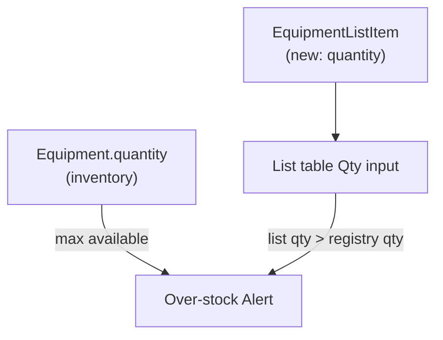

# Equipment list quantities

## Current state

- **Registry** (`[Equipment.quantity](src/lib/db/types.ts)`): how many identical units exist in inventory (e.g. 8 sandbags).
- **List rows** (`[EquipmentListItem](src/lib/db/types.ts)`): one row per `equipment_id`, no quantity — effectively always “1 unit on this list.”
- **UI** (`[EquipmentListDetail](src/features/equipment/page.tsx)`): table has name/UUID/category/serial/OUT/IN; toolbar has Export PDF/CSV, Import CSV, Add from registry.




## Approach

Add `**quantity` to `equipment_list_items**`, mirroring the registry pattern (integer ≥ 1, default 1). Keep **one row per registry item** on a list; quantity means “how many of this SKU to put on the kit,” not duplicate rows.

Validation is **soft only** (per your spec): allow saving any value ≥ 1, highlight over-limit inputs in red, and show a **destructive `Alert`** immediately above the export/import/add button row when any row exceeds registry stock. Recompute on every render from live registry + list data (so lowering registry quantity later still surfaces warnings).

---

## 1. Schema and types

**New migrations**


| Target            | File                                                                                                                       |
| ----------------- | -------------------------------------------------------------------------------------------------------------------------- |
| SQLite (Tauri)    | `[src-tauri/migrations/0072_equipment_list_item_quantity.sql](src-tauri/migrations/0072_equipment_list_item_quantity.sql)` |
| Postgres (server) | `[postgres/migrations/0009_equipment_list_item_quantity.sql](postgres/migrations/0009_equipment_list_item_quantity.sql)`   |


```sql
ALTER TABLE equipment_list_items
  ADD COLUMN quantity INTEGER NOT NULL DEFAULT 1 CHECK (quantity >= 1);
```

Also update fresh-install baselines: `[postgres/schema/baseline.sql](postgres/schema/baseline.sql)`, `[postgres/migrations/0001_baseline.sql](postgres/migrations/0001_baseline.sql)` (add `quantity` to `equipment_list_items` CREATE).

**Type** — extend `[EquipmentListItem](src/lib/db/types.ts)`:

```ts
/** How many units of this registry item to include on the list. Default 1. */
quantity: number
```

**Docs** — update `[docs/equipment.md](docs/equipment.md)` (`EquipmentListItem` section + migration table).

---

## 2. Repository layer

`[src/lib/db/repositories/equipmentLists.ts](src/lib/db/repositories/equipmentLists.ts)`:

- `rowToItem`: read `quantity`; coerce invalid/missing to `1` (same pattern as `[equipment.ts](src/lib/db/repositories/equipment.ts)` `rowToEquipment`).
- `addEquipmentItemToList`: accept optional `quantity`; INSERT includes column (default `1`).
- `updateEquipmentListItem`: allow `quantity` in patch; reject/coerce values `< 1` or non-integer to `1` on write.
- All existing call sites (create list + department bulk-add, CSV add-to-list, demo seed) continue to work via default `1`.

**Demo seed** (`[src/lib/db/seed/demoEquipmentSeed.ts](src/lib/db/seed/demoEquipmentSeed.ts)`): optional small enhancement — for registry rows with `quantity > 1`, set list item `quantity` to `min(registryQty, 2)` on a couple of demo lines so over/under scenarios are visible in demo data (not required for MVP).

---

## 3. Validation helper (testable)

New small module e.g. `[src/lib/equipment/listQuantity.ts](src/lib/equipment/listQuantity.ts)`:

```ts
export function isListQuantityOverRegistry(
  listQty: number,
  registryQty: number | undefined
): boolean

export function getOverStockListItems(
  items: EquipmentListItem[],
  equipmentById: Map<string, Equipment>
): Array<{ item: EquipmentListItem; equipment: Equipment }>
```

Unit tests in `listQuantity.test.ts` (over, equal, under, missing registry row).

---

## 4. UI — `[EquipmentListDetail](src/features/equipment/page.tsx)`

### Warning banner (placement)

Insert **between** the list header block (~~line 1521) and the button toolbar (~~line 1536):

```tsx
{overStockItems.length > 0 && (
  <Alert variant="destructive">
    <AlertTriangle />
    <AlertTitle>Insufficient stock in registry</AlertTitle>
    <AlertDescription>
      {count} item(s) request more units than available: {names…}
    </AlertDescription>
  </Alert>
)}
```

Use existing `[Alert](src/components/ui/alert.tsx)` + `AlertTriangle` (pattern from `[FloatReconciliationDialog](src/features/budget/FloatReconciliationDialog.tsx)`).

### Table

- New column **Qty** (after Serial or before OUT), narrow width.
- Per row: `<Input type="number" min={1} step={1} />` bound to `item.quantity`.
- **On blur** (or Enter): `updateItemMutation({ quantity: parsed })` if changed and valid integer ≥ 1.
- When `isListQuantityOverRegistry(item.quantity, eq?.quantity)`: apply `text-destructive border-destructive` (or `aria-invalid`) on the input.
- Optional muted hint under input: `{eq.quantity} in registry` when `eq.quantity > 1`/a

Update `colSpan` on empty state from 10 → 11.

### Add from registry dialog

- Keep one-click add with default quantity **1**.
- Show registry availability in the list row label when `e.quantity > 1`, e.g. `Sandbags · qty 8` (reuse registry table pattern).

### Create list “Generate from department”

No change required — new items get default `quantity: 1` via repo.

---

## 5. Secondary exports (recommended in same PR)

User did not require these, but they avoid silent loss of quantity on export:


| Surface                                                            | Change                                                                                                                                            |
| ------------------------------------------------------------------ | ------------------------------------------------------------------------------------------------------------------------------------------------- |
| **PDF** (`[equipmentListPdf.ts](src/lib/pdf/equipmentListPdf.ts)`) | Add narrow **Qty** column; print `item.quantity`                                                                                                  |
| **List CSV** (`[csv.ts](src/lib/equipment/csv.ts)`)                | Append `quantity` to `EQUIPMENT_LIST_CSV_HEADERS`; export list-item qty; parse on import (default 1 if column missing for backward compatibility) |


If you prefer a **minimal first PR**, ship UI + DB only and defer PDF/CSV.

---

## 6. Tests

- `listQuantity.test.ts` — pure validation helpers.
- Extend `[postgresFinancialOperationalModules.test.ts](src/test/postgres/postgresFinancialOperationalModules.test.ts)`: `addEquipmentItemToList` with `quantity: 3`, read back; `updateEquipmentListItem` quantity patch.

---

## Files touched (summary)


| Area               | Files                                                              |
| ------------------ | ------------------------------------------------------------------ |
| Migrations         | `0072_*.sql`, `postgres/migrations/0009_*.sql`, postgres baselines |
| Types / repo       | `types.ts`, `equipmentLists.ts`                                    |
| Logic              | `listQuantity.ts` (+ test)                                         |
| UI                 | `page.tsx` (`EquipmentListDetail`)                                 |
| Exports (optional) | `equipmentListPdf.ts`, `csv.ts`                                    |
| Docs / seed        | `docs/equipment.md`, `demoEquipmentSeed.ts`                        |


---

## Out of scope

- Blocking save/export when over stock (warnings only).
- Summing quantities across **multiple lists** for the same registry item (only per-list vs registry stock).
- Changing registry quantity UX (already exists).

