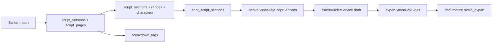

# Script

Script import, sections, sides and breakdown: **Script → Script Import** (`/schedule/script-import`), **Script Sections** (`/schedule/script-sections`) and **Script Breakdown** (`/schedule/script-breakdown`), plus the Sides Builder opened from the Schedule Calendar's Day Summary. The routes stay under `/schedule/` on purpose (the native menu depends on them). **Script Supervisor** is in [script-supervisor.md](script-supervisor.md).

## Code map

| Area | Location |
|---|---|
| Pages/UI | `src/features/schedule/`: `script-import-page.tsx` (+ `script-import-scene-editor-dialog.tsx`), `script-sections-page.tsx` (+ `script-section-edit-dialog.tsx`, `script-section-ui.tsx`, `script-section-views.ts`), `shot-script-section-link-dialog.tsx`, `shoot-day-script-sections-panel.tsx`, `sides-builder-sheet.tsx` (+ `sides-screenplay-preview.tsx`), `coverage-issues-list.tsx`, `script-breakdown-*.tsx`, `sbRemoteNotice.tsx` |
| Parsing | [`src/lib/script-parser/`](../../src/lib/script-parser): `txt-parser.ts`, `pdf-parser.ts` (+ `pdf-parse.worker.ts`), `common.ts`, `index.ts` (`defaultParser`) |
| Services | [`src/lib/db/`](../../src/lib/db): `scriptSectionGenerationService`, `scriptEighthSplitService`, `scriptSectionLayout`, `scriptSectionMatching`, `scriptSectionStatus(Service)`, `scriptSectionReconciliationService`, `shootDayScriptSectionsService`, `sidesBuilderService`, `sidesScriptCollation`, `sidesExportService`, `coverageAnalysisService`, `scriptImportLocationService` |
| Breakdown logic | [`src/lib/breakdown/`](../../src/lib/breakdown): `categories`, `matching`, `autoTag`, `selection`, `sceneSheet`, `tagLayout`, `revisionCarry`; PDFs in `src/lib/pdf/scriptBreakdown.ts` and `src/lib/pdf/sides.ts`; screenplay formatting in [`src/lib/script/screenplayFormat.ts`](../../src/lib/script/screenplayFormat.ts) |
| Repositories | `scriptVersions.ts`, `scriptPages.ts`, `scriptSections.ts`, `sidesExports.ts`, `scriptBreakdown.ts` in [`src/lib/db/repositories/`](../../src/lib/db/repositories) |
| Tables | `script_versions`, `script_pages`, `script_sections`, `script_section_ranges`, `script_section_characters`, `shot_script_sections`, `shoot_day_sides_exports` (`0075`, `0076`, `0077`); `breakdown_elements`, `breakdown_tags` (`0105`); `productions.production_code` (`0104`) |
| Tests | `Script*.integration.test.tsx`, `SidesBuilder`, `ShotSectionLinking`, `ShootDayScriptSections` in `src/features/schedule`; `src/lib/db/script*.test.ts`, `sides*.test.ts`, `coverageAnalysis.test.ts`; `src/lib/script-parser/*.test.ts`, `src/lib/script/screenplayFormat.test.ts`; `src/lib/breakdown/*.test.ts` |

## Data model

| Table | Notes |
|---|---|
| `script_versions` | One per import. `version_label`, `revision_colour`, `episode_id` (null for non-episodic), `previous_script_version_id` (revision lineage) |
| `script_pages` | Per version, one row per scene per physical page slice: `scene_id`, `page_number`, `page_index` (global order), `content`, `eighths`. Source of truth for script text |
| `script_sections` | Per version and scene: `label`, `section_type`, `status` (only `omitted` = Cut is meaningful), `is_manual`, `ranges_user_edited` |
| `script_section_ranges` | `start_page`/`end_page`, eighths, and exact `start_offset`/`end_offset` into page text |
| `script_section_characters` | Character cues of a section, `person_id` resolved from cast `role_name` where it matches |
| `shot_script_sections` | Shot to section links (written from Shot Lists) |
| `shoot_day_sides_exports` | One row per sides PDF export (day, unit, document, script version, `metadata_json`); immutable history |
| `breakdown_elements` | One per thing to source, per production and category. `manual_status` (`needed`/`sourced`), optional `linked_entity_type`/`_id` (location, person, equipment, music_track) |
| `breakdown_tags` | One per highlight: page ids and offsets into `script_pages.content`, `tagged_text`, `carried_from_id` |

All of these are local SQLite only: there are no Postgres tables. For `remote_server` productions, generation returns `null`, shoot-day derivation returns an empty summary, and the pages show `SbRemoteNotice`. Scene import itself still works.

## How it works

**Import.** Pasted text and `.txt` go through `defaultParser`; `.pdf` through `parsePdfScript`, which is layout-aware (positions classify headings, cues, dialogue) and runs in a worker. Scanned PDFs fail with `PdfParseError('no-text-layer')`; there is also `too-many-pages` and `parse-failed`. The result is `ParsedScene[]` (number, slugline, INT/EXT, DAY/NIGHT, location, page/eighth estimates, text, character cues). The upload is also saved as a document (`entity_type` `script`). The user reviews and edits scenes, merges spelling variants of locations (`scriptImportReview.ts`, `scriptImportLocationService.ts`), picks an episode if episodic, and optionally sets a version label, revision colour and "link to previous version". Confirming creates **new** scenes (linked to locations via `location_scene`) and calls `generateScriptVersionFromScenes`, which writes the version, pages and default sections in one serialized transaction. Importing a revision therefore creates new scene rows; versions are compared by scene number, not scene id.

**Sections.** Generation produces one section per eighth-of-a-page span of each scene page, snapped to line boundaries (`splitPageIntoEighths`), with a label like `Scene 12 — Page 3, 2/8–4/8`. The model is fixed at 8 eighths per page; generated ranges are estimates (the UI shows an `est.` badge) and manual sections (`is_manual = 1`) are authoritative. Section codes (`12.1`, `12.2`) are computed per scene in script order, not stored. Editing is highlight-to-select over lines from `scriptSectionLayout.ts`; the newest selection wins, trimming, removing or splitting neighbours (shot links move with them), all in one transaction in `applyScriptSectionLayout`, and sets `ranges_user_edited`. `regenerateSectionsForScriptVersion` re-derives generated sections by signature (scene + type + label), reusing ids so shot links survive and never touching manual sections; no page calls it today.

**Status** is derived (`scriptSectionStatus.ts`): No coverage -> Covered (has linked shots) -> Scheduled -> Shot, or Cut. A section reaches a stage only when every linked shot has: Scheduled = a `SCHEDULED` strip for the shot or its scene; Shot = a printed take for the shot, or the scene marked complete in Script Supervisor. Cut is the one stored state (`status = 'omitted'`); a scene the supervisor marks omitted also counts as cut. Data is loaded by `scriptSectionStatusService.ts`.

**Revisions.** **Compare with previous revision** (`reconcileScriptVersions`) classifies sections as exact/changed/removed/added by scene number, type, label, range and a content fingerprint. **Apply safe shot link remaps** moves shot links between generated sections only; links to manual sections are never remapped.

**Sides.** `deriveShootDayScriptSections` takes the day's scheduled strips, their shots and the shot to section links; a scheduled scene with no linked sections falls back to its full-scene sections (flagged `fallback`). `sidesBuilderService` filters (unit, episode, scene, character, location, linked-shot-only, full-scenes-only), applies manual include/exclude, groups by episode and scene, and validates. `coverageAnalysisService` produces typed issues (severity info/warning/blocking); only an empty selection blocks export. `exportShootDaySides` renders the PDF first, stores it via `persistProductionDocument` (entity `sides_export`, listed under Documents), then inserts the export row; a failed DB write removes the file. Exports are never replaced.

**Sides formatting.** Sides are set as a shooting script: US Letter, Courier 12pt, 54 lines a page, scene numbers in both margins of each heading, and the standard indents (action and headings 1.5", dialogue 2.5", parenthetical 3.0", character 3.5", transitions right-aligned to 7.5"). `screenplayFormat.ts` re-classifies stored page text (blank-line separated blocks) with the parser's heading, transition and cue rules. It keeps the source's line breaks when they already fit a column and reflows them otherwise. Paging keeps headings and cues off the bottom of a page and splits long speeches with `(MORE)` / `(CONT'D)`. The PDF has a small running header (production | SIDES | date | unit | episode) with the page number top right, and a compact info block (script version, eighths, warnings) on page one only. The Sides Builder preview uses the same formatter and column table. Limits: classification is text-based, so TXT imports without blank lines between elements come out mostly as action; dual dialogue prints sequentially; pages are numbered from 1, not with the original script page numbers.

**Breakdown.** Select words in the Script view (browser selection mapped to page offsets in `selection.ts`, snapped to whole words) and tag with a category button or key `1`-`9`, `0`, `-`. Eleven categories in `categories.ts` (Cast, Props, Extras, Costume, Locations, Lighting, Foley/Music, Special FX, Stunts/Choreography, Animals/Children, Vehicles) give colour, shortcut and whether the category is `matchable`. A tag finds or creates the element whose normalised name matches (`normalizeNameKey`), so "BEACH" in two scenes is one element. Overlapping tags render as stacked bands (`segmentByCoverage`). **Suggest cast & location** (`autoTag.ts`) offers the heading location and each speaking character. Older drafts are read-only. The **Sheet** view is built by `buildSceneSheet` (scene, pages, date from latest tag change, production title and `production_code`, edited in the Productions edit dialog). The **Elements** view is the department list: rename, merge, delete, link, notes.

Sourced status is a pure function in `matching.ts`:

| Category | Matched against | Sourced when |
|---|---|---|
| Locations | Locations | booked or wrapped; on hold/unbooked is In progress |
| Cast | cast by role name, then name | found and in `scene_cast` of every tagged scene; else In progress |
| Lighting | Equipment (`lighting`, `lighting_accessories`) | found |
| Foley/Music | Music tracks and clearances | found; In progress until a clearance is granted |
| Others | none | the element's manual status |

A linked row wins; otherwise a single exact name match is used (offered as **Confirm link**); looser matches (`bestMatches`) are only suggestions; a manual "sourced" always wins. To add a category's database, add a candidate list and judge in `matching.ts`.

**Breakdown across drafts.** Opening the latest draft runs `carryBreakdownTagsForward`: each earlier tag is carried once, on the same element. `revisionCarry.ts` pairs the scene's lines in both drafts (Script Supervisor's `matchElements`) and marks each tag carried, moved or unmatched in `script_revision_items` (`item_type = 'breakdown_tag'`). Moved/unmatched tags are listed until marked done. Exports (`src/lib/pdf/scriptBreakdown.ts`) are scene sheets and a department list with tick boxes, saved to Documents under Script & sides.

## Connections

- Phone layouts for Script Sections, the link dialog and Script Breakdown (segmented **Sections** / **Script** view, scene picker, tap-to-select ranges, docked category picker) are listed in [ui.md](../ui.md#phone-and-touch-layout).
- Schedule: scenes and shots, shot links, Day Summary sides panel, strips drive Scheduled status ([schedule.md](schedule.md)).
- Script Supervisor reads the same versions/pages and feeds Shot/Cut status and revision carry ([script-supervisor.md](script-supervisor.md)).
- Breakdown reads Locations, Cast, Equipment, Music & Archive; cast/location suggestions use `people.role_name`.
- Duplicate production copies all script and breakdown tables (`duplicateProduction.ts`); breakdown copies keep location/cast/music links and drop equipment links. `.apf` export includes them ([import-export.md](../import-export.md)).

## Gotchas

- Soft-deleting a `script_version` does not cascade; filter children by `deleted_at`.
- Writes are multi-row: use `runInSerializedTransaction` with one `executeBatch` and outbox rows in the same batch ([database.md](../database.md)).
- Offsets index `script_pages.content`; changing page text invalidates ranges and tags.
- Generation signatures use the label, which encodes scene number and span; changing label format breaks regeneration and reconciliation matching.
