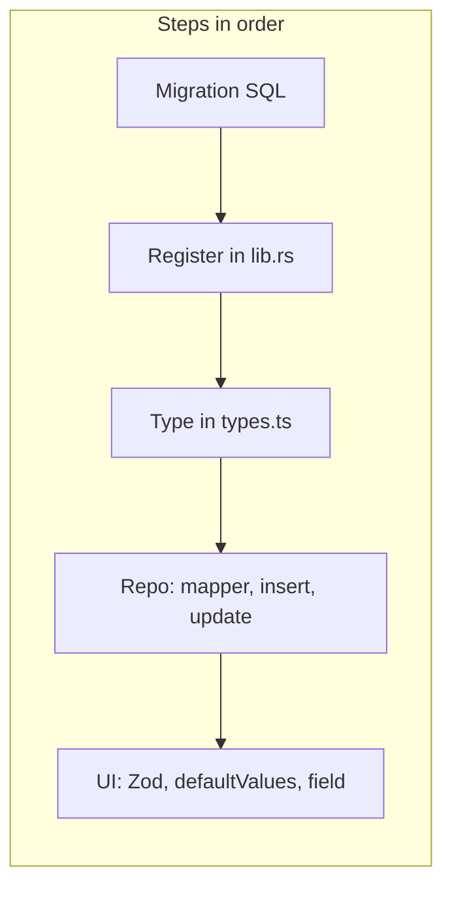

# Adding a new property to an entity

This guide explains how to add a new property to an existing entity in Albatross. Adding a property touches the database, TypeScript types, the repository layer, and the UI. **Important:** creating a migration file is not enough on its own — you must also register it in `lib.rs` or it will never run and the app will hit errors like "no such column".

We use the **what3words on locations** feature as the concrete example. Follow the steps in order so the database column exists before the app reads or writes it.



---

## 1. Write the migration file

**Where:** [src-tauri/migrations/](src-tauri/migrations/). Use the next sequential number (e.g. after `0033_locations_w3w.sql` the next would be `0034_*.sql`).

**Naming:** `NNNN_<entity>_<short_descriptor>.sql` (e.g. `0033_locations_w3w.sql`).

**Content:** For a new nullable column, a single `ALTER TABLE` is enough.

Example from [src-tauri/migrations/0033_locations_w3w.sql](src-tauri/migrations/0033_locations_w3w.sql):

```sql
-- Locations: add what3words column.
ALTER TABLE locations ADD COLUMN what3words TEXT;
```

Use the appropriate SQLite type: `TEXT`, `REAL`, `INTEGER`, etc.

**Note:** Migrations are **not** applied automatically just by adding a file. They must be registered in `lib.rs` (Step 2).

---

## 2. Register the migration in lib.rs

**Where:** [src-tauri/src/lib.rs](src-tauri/src/lib.rs).

**What lib.rs does:** Defines the Tauri app entry point and configures plugins. The SQL plugin is given a **single ordered list** of migrations. When the app opens the database (`sqlite:albatross.db`), the plugin runs any migrations that have not yet been applied (tracked by the plugin). If a migration file exists on disk but is **not** in this list, it will never run and the column will not exist — leading to runtime errors like "no such column: what3words".

**What to add:** Append a new `Migration { ... }` to the `migrations` vec:

- `version`: next integer (e.g. 34).
- `description`: short snake_case identifier matching the migration filename (e.g. `"locations_w3w"`).
- `sql`: `include_str!("../migrations/NNNN_entity_descriptor.sql")`.
- `kind`: `MigrationKind::Up`.

Example for the what3words migration:

```rust
Migration {
    version: 33,
    description: "locations_w3w",
    sql: include_str!("../migrations/0033_locations_w3w.sql"),
    kind: MigrationKind::Up,
},
```

**Critical:** After adding both the migration file and the lib.rs entry, perform a **full app restart** so the database is opened with the new list and the new migration runs.

---

## 3. Extend the relevant type

**Where:** [src/lib/db/types.ts](src/lib/db/types.ts).

**What to do:** Add the new field to the entity type (e.g. `Location`). Use the same name as the column and an appropriate TypeScript type (`string | null`, `number | null`, etc.).

Example — `Location` with `what3words` (see [src/lib/db/types.ts](src/lib/db/types.ts) around lines 37–47):

```ts
export type Location = {
  id: string
  production_id: string
  name: string
  booked_status: 'unbooked' | 'hold' | 'booked' | 'wrap'
  address: string | null
  what3words: string | null   // new property
  availability_constraints: string | null
  permit_fee: number | null
  location_fee: number | null
  notes: string | null
} & SoftDeletable
```

**Convention:** Domain types in `types.ts` are the single source of truth for shape; repositories and UI types (Zod) should align with them.

---

## 4. Wire it through the repository

**Where:** The repository for that entity, e.g. [src/lib/db/repositories/location.ts](src/lib/db/repositories/location.ts).

**What the repository does:** Repositories encapsulate all database access for an entity: they run SQL (via `getDb().execute` / `getDb().select`), map rows to domain types, and push outbox entries for sync. No other layer should touch the database for that entity.

**Changes required** (using location + what3words as the template):

### Row mapper

In `rowToLocation` (or the equivalent mapper), add a line mapping the new column from the row to the type:

```ts
what3words: r.what3words as string | null,
```

### Insert type

In `LocationInsert` (or equivalent), include the new field in the optional `Partial<Pick<...>>` so create can accept it:

```ts
type LocationInsert = Pick<Location, 'production_id' | 'name' | 'booked_status'> &
  Partial<Pick<Location, 'address' | 'what3words' | 'availability_constraints' | 'permit_fee' | 'location_fee' | 'notes'>>
```

### createLocation INSERT

Add the column name to the INSERT column list and a corresponding `$N` placeholder; add `data.<field> ?? null` (or equivalent) to the values array in the **same order** as the column list. Getting the order wrong causes wrong data or "parameter count" errors.

```ts
await db.execute(
  `INSERT INTO ${TABLE} (id, production_id, name, booked_status, address, what3words, availability_constraints, permit_fee, location_fee, notes, created_at, updated_at)
   VALUES ($1, $2, $3, $4, $5, $6, $7, $8, $9, $10, $11, $12)`,
  [
    id,
    data.production_id,
    data.name,
    data.booked_status ?? 'unbooked',
    data.address ?? null,
    data.what3words ?? null,   // same position as column list
    data.availability_constraints ?? null,
    data.permit_fee ?? null,
    data.location_fee ?? null,
    data.notes ?? null,
    ts,
    ts,
  ]
)
```

### updateLocation

Add the field name to the `allowed` array so updates can set it. The dynamic SET clause iterates over `allowed`; no extra logic is needed unless the column type needs coercion (e.g. for REAL columns, coerce empty string/NaN to null — see `permit_fee` / `location_fee` in [src/lib/db/repositories/location.ts](src/lib/db/repositories/location.ts)):

```ts
const allowed = ['name', 'booked_status', 'address', 'what3words', 'availability_constraints', 'permit_fee', 'location_fee', 'notes'] as const
```

**Optional:** If the entity is duplicated elsewhere (e.g. in `duplicateProduction`), ensure the new field is copied if applicable.

---

## 5. UI implementation (Zod + forms)

**Where:** The feature page that owns the entity form, e.g. [src/features/locations/page.tsx](src/features/locations/page.tsx).

### Zod schema

Add the new key to the form schema with the right validator — `z.string().optional()` for optional text, `z.coerce.number().optional()` for optional numbers. This defines both validation and the shape of the form type (via `z.infer`):

```ts
const locationSchema = z.object({
  name: z.string().min(1),
  booked_status: z.enum(['unbooked', 'hold', 'booked', 'wrap']),
  address: z.string().optional(),
  what3words: z.string().optional(),   // new field
  availability_constraints: z.string().optional(),
  permit_fee: z.coerce.number().optional(),
  location_fee: z.coerce.number().optional(),
  notes: z.string().optional(),
})

type LocationForm = z.infer<typeof locationSchema>
```

### Form defaultValues

In the component that uses `useForm`, add the new field to `defaultValues` so both create and edit show the correct initial value:

```ts
defaultValues: {
  name: defaultValues.name ?? '',
  booked_status: defaultValues.booked_status ?? 'unbooked',
  address: defaultValues.address ?? '',
  what3words: defaultValues.what3words ?? '',
  // ... rest
},
```

### Form field

Add a labeled control in the form JSX so the user can view and edit the value:

```tsx
<div>
  <Label>what3words</Label>
  <Input {...form.register('what3words')} />
</div>
```

### List/table (optional)

If the property should appear in the list view, add an `accessorKey` (and optional `cell` formatter) to the table columns definition.

**Note:** Create and update mutations already receive the full form object (`LocationForm`), so no change is needed there as long as the schema and defaultValues include the new field.

---

## Checklist

Before considering the feature done, confirm:

- [ ] Migration file added under `src-tauri/migrations/` with next sequential number and correct naming.
- [ ] Migration registered in `src-tauri/src/lib.rs` (version, description, sql, kind).
- [ ] Type updated in `src/lib/db/types.ts`.
- [ ] Repository: row mapper, insert type, INSERT column + values, and `allowed` in update.
- [ ] UI: Zod schema, form defaultValues, form field; optionally list/table column.
- [ ] App restarted after adding the migration so it runs.

---

## Gotchas

1. **Restart the app after adding a migration.** The migration runs when the database is opened. If you only add the file and the lib.rs entry but don’t restart, the column won’t exist and you’ll see "no such column" at runtime.

2. **INSERT column list and values array order must match.** The column list and the values you pass to `db.execute` must be in the same order; otherwise data goes into the wrong columns or the bind count is wrong.

3. **REAL/numeric fields:** Form number inputs can submit empty string. Binding `""` to a REAL column can cause the SQL layer to throw. In the repository, coerce empty string or NaN to `null` for numeric fields (see `permit_fee` / `location_fee` in [src/lib/db/repositories/location.ts](src/lib/db/repositories/location.ts)).
