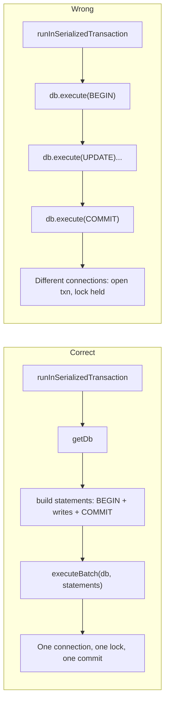

# Database layer: transactions and locking

This document explains how Albatross interacts with SQLite via the Tauri SQL plugin so that new and modified code avoids "database is locked" errors and open transactions. Follow these rules to keep the DB layer predictable and safe.

## 1. Why locking and open transactions happen

**Connection pool.** The Tauri SQL plugin uses a connection pool. The app has one logical `db` from `getDb()`, but each `db.execute()` or `db.select()` can be dispatched to a **different connection**.

**Consequence.** If you run `db.execute('BEGIN')` then later `db.execute('UPDATE ...')` and `db.execute('COMMIT')`, those three calls can use three different connections. The connection that ran `BEGIN` never gets `COMMIT`, so it holds an open transaction and keeps the DB lock. Other writers then hit "database is locked" (SQLITE_BUSY) and retries.

**Evidence in this codebase.** Duplicate production (see `src/lib/db/duplicateProduction.ts` header), budget backfill (fixed by batching), and schedule/calendar moves (fixed by using `executeBatch` for BEGIN…COMMIT) have all hit or fixed this pattern.

## 2. What the client already does

- **Execute serialization:** Wrapped `db.execute()` calls run through a **re-entrant global tail queue** so the Tauri SQL pool does not perform conflicting writes on different connections; nested `runInSerializedTransaction` / inner `execute` runs inline when already inside a holder. (Legacy “write queue” wording referred to the same problem space; see `runSerializedExecute` in `src/lib/db/client.ts`.)
- **Retry:** Execute and select retry on SQLITE_BUSY up to 3 times with backoff.
- **WAL + busy_timeout:** PRAGMA journal_mode = WAL, busy_timeout = 8s, foreign_keys ON (see `src/lib/db/client.ts`).
- **Nested `runInSerializedTransaction`:** If a callback awaits another `runInSerializedTransaction`, the inner call runs **re-entrantly** (same write-queue slot). Re-queueing would **deadlock**: the outer task holds the queue until the inner promise settles, but the inner task would be scheduled *after* the outer task. Symptom: UI freeze or eventual SQLITE_BUSY. Regression test: `src/lib/db/clientSerializedTransaction.test.ts`.

**Important:** Serializing writes does **not** fix multi-statement transactions, because each `execute()` inside one logical transaction can still run on a different connection. The fix is to make the **whole** transaction a **single** `execute()`.

## 3. Golden rule: one transaction = one execute

Any logical transaction (BEGIN … COMMIT) must be sent as **one** call to the DB so it runs on **one** connection.

**Mechanism:** `executeBatch` (in `src/lib/db/client.ts`) takes an array of `{ sql, bindValues }`, renumbers placeholders, and runs `db.execute(combinedSql, combinedBind)` once. Use it for every multi-statement transaction.

## 4. Required pattern for multi-statement transactions

1. Use **runInSerializedTransaction** so the transaction is one slot in the write queue and no other write runs in between.
2. Inside the callback: `const db = await getDb()` then build `statements: Array<{ sql, bindValues }>` with **BEGIN** as first element, all data statements (INSERT/UPDATE/DELETE), then **COMMIT** as last element.
3. Include outbox rows in the same batch via `outboxStatementForRow` / `outboxStatementForRows` (in `src/lib/db/outbox.ts`) so the outbox is in the same transaction and connection.
4. Call **executeBatch(db, statements)** once.

Do **not** use separate `db.execute('BEGIN')`, `db.execute(...)`, `db.execute('COMMIT')` inside the callback.

## 5. Single-statement writes (no transaction)

One-off INSERT/UPDATE/DELETE: call `db.execute(...)` as usual. It is automatically queued; no need for `runInSerializedTransaction` unless you are combining multiple statements.

## 6. Reads

`db.select()` is not queued and does not open a long-lived transaction. Use as needed; no special rules for reads.

## 7. Anti-patterns

| Anti-pattern | Why it fails |
|-------------|--------------|
| **BEGIN then loop of execute() then COMMIT** | Each execute can use a different connection; the one that ran BEGIN never gets COMMIT. (This was the budget backfill bug.) |
| **Multiple round-trips to "ensure" data** | e.g. SELECT then INSERT in a loop, or many small INSERTs from one logical operation. Minimize round-trips: batch into one INSERT (or INSERT OR IGNORE) or one executeBatch. |
| **Outbox in a separate execute after the main write** | Doubles round-trips and can interleave with other writes. Prefer outbox statements inside the same executeBatch as the primary write. |

## 8. Where this is done correctly today

- **schedule.ts** (`src/lib/db/repositories/schedule.ts`): `moveShootDayToDate`, `moveShootDayUnitToDate`, `mergeShootDayUnitIntoDay`, etc. build statements with BEGIN, entity updates, outbox statements, COMMIT; then `runInSerializedTransaction` + `executeBatch`.
- **budget.ts** (`src/lib/db/repositories/budget.ts`): `backfillAccountIdsFromLegacyCategories` uses one `executeBatch(BEGIN, UPDATEs, COMMIT)` inside `runInSerializedTransaction`.
- **duplicateProduction.ts** (`src/lib/db/duplicateProduction.ts`): Single `executeBatch(BEGIN, all INSERTs, COMMIT)`; no separate BEGIN/COMMIT calls.
- **settings.ts** (`src/lib/db/repositories/settings.ts`): `ensureSettingsDefaults` uses `runInSerializedTransaction` + single INSERT OR IGNORE for all default keys.
- **Demo crew seed** (`src/lib/db/seed/demoCrewSeed.ts`): `seedDemoCrew` uses `runInSerializedTransaction` + `executeBatch` with **BEGIN**, then **multi-row `INSERT`s** (people, vendors, invoices, tasks) instead of dozens of single-row statements — same transaction (§4), much less work for the driver/sqlx and shorter time holding the JS write queue (so dev tools like Verify Cascades wait less when backfill runs).
- **Demo bookings seed** (`src/lib/db/seed/demoBookingSeed.ts`): `seedDemoBookings` and `seedDemoCrewBookings` build many INSERTs and pass them to **one** `executeBatch` → one combined `db.execute` (§3). That avoids the “loop of separate executes” anti-pattern (§7). They do not add an explicit BEGIN/COMMIT wrapper; atomicity is the same class as other bulk seeds. `ensureDemoData` backfill (`maybeBackfillSingletonDemoCrewIfEmpty` in `demoProductionSeed.ts`) runs that crew transaction and then the bookings batch **sequentially** — two write-queue slots, not interleaved BEGIN/COMMIT across connections.
- **verifyCascades** (`demoProductionSeed.ts`): Runs the setup `executeBatch` and the orphan-check `select` inside **one** `runInSerializedTransaction` so another queued write cannot run between them (reduces SQLITE_BUSY / “database is locked” / error 5 when the UI is writing elsewhere).

## 9. Checklist for new or modified DB code

- Need a **transaction** (multiple writes that must commit together)? → Use **runInSerializedTransaction** + **executeBatch(db, [BEGIN, ...writes..., COMMIT])**. Include outbox in the batch if the operation syncs.
- Only **one** write? → Use **db.execute(...)** (queued automatically).
- **Init / "ensure defaults"**? → Prefer one batched write (e.g. INSERT OR IGNORE for multiple rows) inside `runInSerializedTransaction` to avoid interleaving with other writes.

## 10. Client PII encryption

When UAM1 auth tables exist, `clients.name` / `email` / `phone` are encrypted at rest. Decrypted reads/writes require an in-memory DEK from sign-in via [`requireSensitiveDataAccess()`](../src/lib/security/sensitiveDataAccess.ts). ID-only checks use `clientExistsById`. See [DATA_ENCRYPTION.md](DATA_ENCRYPTION.md) and [SQLCIPHER_SPIKE.md](SQLCIPHER_SPIKE.md).

## 11. SQLCipher (local file)

- `albatross.db` is **not** preloaded at app startup ([`tauri.conf.json`](../src-tauri/tauri.conf.json)).
- When `albatross.db.meta.json` exists, unlock via [`openDbWithFileKey`](../src/lib/db/client.ts) after sign-in; `getDb()` throws `DatabaseLockedError` while locked.
- Logout must call `closeDb()` ([`clearPersistedAuthSession`](../src/lib/auth/authService.ts)).

## 12. Known legacy exception

**production.ts** (`src/lib/db/repositories/production.ts`): `reserveSlugAndInsertProduction` still uses `db.execute('BEGIN TRANSACTION')` then `db.execute(INSERT...)` in two calls. It is not used by duplicateProduction anymore (duplicate uses executeBatch). If anything else ever calls it, it should be refactored to a single executeBatch(BEGIN, INSERT, COMMIT) or removed. Do not copy this pattern.
