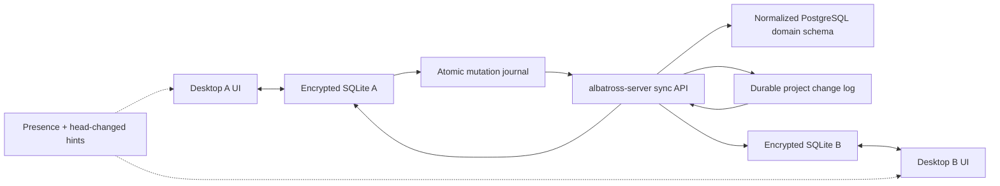

# Local collaboration implementation plan

Status: architecture and delivery plan with product decisions confirmed  
Reviewed: `albatross` and the current working tree of `albatross-server`  
Date: 17 August 2026

Implementation started: 17 August 2026. The desktop foundation now includes the durable collaboration setting migration, global-off routing guard, separately gated legacy remote runtime, sync-v2 SQLite control schema, pilot productions/scenes/shots registry with explicit deferred FKs, versioned/correlated HTTP client contract, immutable mutation-to-wire reconstruction, and atomic local mutation/pull-apply transaction helpers with rollback and stale-cursor guards. Server endpoints, managed PostgreSQL/server process supervision, repository adoption, and live end-to-end replication remain subsequent work.

## 1. Executive decision

Build local collaboration as bidirectional replication, not as remote repository branching.

- PostgreSQL is the authoritative committed store for a production while that production is collaborative.
- Each desktop keeps a complete encrypted SQLite replica and all UI code continues to read and write SQLite.
- Every local write and its pending mutation are committed atomically in SQLite.
- `albatross-server` accepts ordered mutation batches, applies them transactionally to normalized PostgreSQL tables, and appends them to a durable per-project change log.
- Every client pulls that log by cursor and applies changes plus its cursor atomically to SQLite.
- WebSockets are wake-up hints and presence only; the durable REST change feed is the source of replication truth.
- Desktop clients never connect directly to PostgreSQL.

This replaces the current hybrid in which a few repositories read/write remote JSON resources while the rest continue to use SQLite.

## 2. Confirmed requirements and working defaults

Confirmed product requirements:

1. Albatross installs/provisions PostgreSQL and `albatross-server` for app-managed hosting, but starts them only after the user explicitly chooses **Start local server** in Settings.
2. Enabling client collaboration, opening a linked production, or starting Albatross must not implicitly start a local host.
3. Users can instead connect to an independently installed `albatross-server` on another machine. Albatross must not try to manage that remote process.
4. Sensitive production fields must be application-encrypted before PostgreSQL persistence. PostgreSQL data files, WAL, database dumps, and ordinary backups must not contain plaintext PII.
5. The first pilot synchronizes database rows. Attachment and storyboard bytes follow as a separately gated phase.

Working defaults retained by this plan:

1. One machine is the explicit LAN host in v1. Host election and automatic failover are out of scope.
2. Offline editing is required. Local changes are visible immediately but remain unconfirmed until PostgreSQL accepts them.
3. The collaboration registry classifies the complete closure of production database rows, even if pilot functionality is released in coherent dependency rings.
4. Turning collaboration off never deletes the server project. A normal detach first reaches the server head and drains local pending work, then keeps a final SQLite copy.

## 3. Current implementation assessment

There is valuable scaffolding in both repositories, but the current beta is not an end-to-end collaboration system.

### 3.1 Reusable client foundations

- The app already has a `DatabaseAdapter`, a production-tested SQLite adapter, stable client-generated UUIDs, and PostgreSQL compatibility work in `src/lib/db/`.
- The SQLite schema is already encrypted, mostly uses stable IDs and timestamps, and has an outbox-oriented repository convention.
- `src-tauri/migrations/0067_server_collab.sql` already provides connection, linked-project, publish-job, and pending-server-outbox tables that can be migrated into sync-v2 state.
- `src/lib/publish/tableOrder.ts`, APF import/export ordering, and package codecs provide a useful starting point for snapshot ordering and asset enumeration.
- `linked_projects`, connection setup, publish UI, presence UI, and status banners can be retained after their semantics are changed.

### 3.2 Reusable server foundations

- Fastify wiring, PostgreSQL pooling and migrations, authentication, refresh sessions, project membership ACLs, audit logs, request IDs, metrics, and health endpoints are suitable control-plane foundations.
- Publish jobs provide a usable long-running bootstrap shell once the package contract and import target are corrected.
- Presence is already separate enough to retain for collaborator counts.
- Integer `revision` fields demonstrate the intended concurrency model, although the current routes still compare timestamps.

### 3.3 Blocking gaps

1. **The toggle only hides UI.** `ServerPublishingSettingsSection.tsx` writes `feature_server_publish_enabled`, while `projectDataSource.ts` ignores that value and routes any `linked`, `offline`, or `conflict` project to remote reads.
2. **There is no pull path.** `syncEngine.ts` only replays a narrow pending queue. It has no cursor, inbound feed, SQLite applier, tombstone handling, or convergence check.
3. **Runtime coverage is partial and split-brain.** Only parts of schedule and budget branch to remote REST. Most repositories still use SQLite, and several remote write operations are missing.
4. **Offline edits are not local-first.** Some linked creates try the server, enqueue intent after a network failure, then throw without inserting the row locally.
5. **The client and server wire contracts do not match.** The client sends flat row bodies and maps flat snake-case rows; the server expects and returns nested `data`. The client expects direct publish-job responses; the server wraps them in `job`.
6. **The publish formats do not match.** The desktop uploads a ZIP with manifest and data entries, while the server reads the uploaded file as one legacy UTF-8 JSON manifest.
7. **Publish and runtime write different PostgreSQL stores.** Publish imports `project_entities`; live REST reads six `runtime_*` tables. The migration between them runs only once.
8. **Deletes and cursors cannot replicate.** Runtime deletes are physical and the server has no durable change sequence or tombstones.
9. **Concurrency and idempotency are not atomic.** Runtime compare-then-update can lose a true race. Idempotency lookup happens before mutation and response storage happens later in `onSend`.
10. **Server project ID and production ID are conflated in the join flow.** They must remain separate identities.
11. **Coverage artifacts are stale.** At review time the publish list contained 62 tables and the PostgreSQL schema-parity test reported 69 PostgreSQL tables versus 88 SQLite tables. Migration 0087 adds seven deliberately client-side sync control tables, so the raw audit now sees 95 SQLite tables; registry-aware parity must distinguish local control tables from the missing collaborative domain closure. Several later script and operational tables remain absent from the publish closure.
12. **Rows are not enough for documents.** Document/storyboard database rows contain device-local paths; another client needs asset bytes plus a local path mapping.
13. **Sensitive-field handling is incomplete for replication.** People, location, and vendor values are encrypted at rest locally. Outbound sync must decrypt for the server trust boundary and inbound sync must re-encrypt before SQLite persistence.
14. **LAN defaults are unsafe.** The server binds all interfaces, accepts default admin credentials, permits broad CORS, allows plain HTTP, and puts the access token in the presence WebSocket query string.
15. **The packaged server path is unreliable.** TypeScript emits under `dist/src`, `npm start` targets `dist/index.js`, and migration discovery depends on the current working directory.

The existing server working tree also contains extensive uncommitted work. Establish a reviewed commit before implementing sync-v2 so code, generated `dist`, tests, and documentation refer to one baseline.

## 4. Target architecture



### 4.1 Source-of-truth invariants

- `local_only`: SQLite is authoritative and no sync traffic occurs.
- `collaborative`: committed PostgreSQL state is authoritative; SQLite is the complete read model and offline working replica.
- A pending local edit is never presented internally as server-confirmed.
- The same repository path runs online and offline. Network state changes delivery timing, not write semantics.
- A server event and the client's applied cursor commit in the same SQLite transaction.
- A server mutation and its change-log entries commit in the same PostgreSQL transaction.
- Once traffic stops and queues drain, normalized hashes of PostgreSQL and every linked SQLite replica must match.

### 4.2 PostgreSQL schema boundaries

Use separate schemas so the server control plane cannot collide with desktop-domain tables:

- `collab`: users, sessions, projects, memberships, devices, sync heads, cursors, mutation receipts, change batches, audit metadata, and asset metadata.
- `domain`: the normalized Albatross production schema derived from the desktop's PostgreSQL migrations.

Keep these identities distinct:

- `collab.projects.id`: server/ACL project ID used in URLs and membership checks.
- `domain.productions.id`: stable production UUID copied to every SQLite replica.

`collab.projects.production_id` maps the two. The join flow must use `production_id` when creating the local SQLite production.

Do not retain both `project_entities` and `runtime_*` as live stores. Sync-v2 should import snapshots and apply mutations to the same normalized `domain` tables.

### 4.3 Shared collaboration registry

Create a versioned, machine-readable registry consumed by both codebases. For every collaborative table it defines:

- primary key and production ownership resolver;
- allowed columns and wire codecs;
- parent/child dependency order;
- create, update, soft-delete, and hard-delete semantics;
- sensitive-field outbound and inbound transforms;
- merge policy and fields that require manual conflict resolution;
- asset references;
- whether the table is production-scoped, workspace-scoped, derived, or device-local.

Start with `PUBLISH_TABLE_ORDER`, then compute the full relational closure from current migrations. Explicitly classify newer script versions/pages/sections, sides exports, vendor exclusions, instance-level clients, users, settings, caches, local sessions, local outboxes, and device paths.

The registry, not scattered arrays, becomes the source for:

- server input allowlists and validators;
- snapshot table ordering;
- SQLite apply ordering;
- PostgreSQL schema parity checks;
- repository writer-coverage tests;
- asset extraction;
- protocol schema version/hash.

## 5. Durable server sync model

Add the following control-plane records. Exact names can change, but their semantics should not.

### 5.1 `project_sync_heads`

- `project_id`
- `epoch_uuid`
- `head_seq`
- `min_retained_seq`
- `schema_version`
- `registry_hash`
- timestamps

The epoch changes after restore/reinitialization. A client with another epoch must re-bootstrap.

### 5.2 `change_batches`

- `project_id`
- monotonically allocated `seq`
- logical `transaction_id`
- `actor_user_id`
- `client_id`
- `mutation_id`
- `committed_at`

Lock the project head row while allocating `seq`. A pull response must not split a batch.

### 5.3 `change_rows`

- `project_id`, `seq`, and `ordinal`
- `table_name`, `row_id`, and operation (`upsert` or `delete`)
- authoritative integer `row_version`
- full canonical post-image for upserts
- explicit tombstone metadata for deletes

Full post-images keep pull application deterministic. Client mutations can still send patches plus base values for efficient conflict detection. Classified sensitive fields use the same ciphertext envelope in the change log as in canonical domain tables; the API decrypts them only while constructing an authorized response.

### 5.4 `entity_versions`

- `project_id`, `table_name`, and `row_id`
- integer `version`
- `deleted`
- latest change `seq`

Use numeric compare-and-swap in the same SQL transaction as the domain write. Do not use `updated_at` equality as the authoritative precondition.

### 5.5 `client_cursors` and devices

Extend the current link concept with:

- stable installation/client ID and user-friendly device label;
- protocol and schema version;
- epoch and applied sequence;
- last-seen and last-acknowledged timestamps;
- pairing/revocation state;
- optional push notification connection metadata.

Revoking a device stops new sync credentials without deleting project data or removing other members.

### 5.6 Mutation receipts

Persist a durable receipt keyed by `(project_id, client_id, mutation_id)` in the same transaction as the mutation. Store request hash and canonical result cursor.

Receipts must outlive realistic offline periods. The current 24-hour HTTP idempotency TTL is insufficient for a durable desktop outbox.

### 5.7 Project encryption keys

Add project data-key records containing:

- `project_id` and data-key version;
- authenticated-encryption and wrapping algorithm identifiers;
- the project data-encryption key wrapped by the host key-encryption key;
- creation, rotation, retirement, and recovery-check timestamps.

Persist sensitive values as versioned envelopes containing only algorithm/version, key ID, nonce, ciphertext, and authentication tag. Bind project, table, row, column, and envelope version as authenticated associated data so ciphertext cannot be moved between records undetected. Never persist the host key-encryption key, unwrapped data keys, decrypted snapshot caches, or plaintext PII in PostgreSQL.

## 6. Sync protocol

Version the replication API separately from the current beta runtime endpoints.

### 6.1 Discovery and compatibility

`GET /.well-known/albatross`

Return server instance ID, API versions, schema version, registry hash, TLS identity, feature capabilities, and maximum batch/snapshot sizes. Reject incompatible clients before any publish or join mutation.

### 6.2 Host/bootstrap

`POST /v2/projects/:projectId/sync/bootstrap`

- Requires project admin/editor permission appropriate to first publish.
- Accepts the current versioned ZIP snapshot and assets manifest.
- Validates table registry, row counts, hashes, ownership, and FKs.
- Streams sensitive fields through validation and encryption without writing plaintext temporary files.
- Creates/imports the normalized domain project atomically.
- Creates the initial sync head and returns `{ productionId, epoch, cursor, snapshotHash }`.
- Is transactionally idempotent by a durable bootstrap mutation ID.

Use the existing desktop package codec or share it with the server. Delete the legacy inline-JSON parser once beta migration is complete.

### 6.3 Join/snapshot

`GET /v2/projects/:projectId/sync/snapshot`

- Streams a consistent snapshot captured at a declared high-water cursor.
- Supports chunking/resume, table counts, checksums, and asset metadata.
- Decrypts classified values only after authorization and emits them directly into the TLS response; any resumable cache must itself be encrypted.
- Returns the real `productionId`, never just the server project ID.
- Forces re-bootstrap on expired cursor, changed epoch, or incompatible schema.

### 6.4 Pull

`GET /v2/projects/:projectId/sync/changes?after=<epoch:seq>&limit=<n>`

- Returns ordered complete batches after the cursor.
- Includes tombstones.
- Returns current head and `hasMore`.
- Returns `410 cursor_expired` when `after` predates retained history.
- Allows gaps in project sequence allocation but never reorders or splits a batch.

### 6.5 Push

`POST /v2/projects/:projectId/sync/mutations`

One request represents one logical local transaction:

```text
mutationId
clientId
baseCursor
operations[]:
  table
  rowId
  create | patch | delete
  baseVersion
  baseValues
  patch or fullRow
```

Server processing order:

1. Authenticate, validate active device, and enforce project role.
2. Validate protocol/schema/registry versions.
3. Claim or replay the durable mutation receipt.
4. Validate table/column allowlists and prove every row belongs to the route project.
5. Lock current row versions and perform conflict checks.
6. Apply the whole logical transaction to normalized domain tables.
7. Increment entity versions and append one ordered change batch.
8. Commit domain changes, receipt, change log, and new head together.
9. Return accepted events and the committed cursor.

Reject the entire logical transaction if one operation is invalid or conflicts. This preserves business operations such as moving a schedule unit or creating an expense plus its detail rows.

### 6.6 Acknowledge and realtime hints

`POST /v2/projects/:projectId/sync/ack` records the client's applied cursor for retention and diagnostics.

Presence WebSocket may send `head_changed { projectId, epoch, headSeq }` after commit. Clients always pull from the durable feed; missed WebSocket messages do not lose data. Use PostgreSQL `LISTEN/NOTIFY` or another shared bus if more than one server process can run.

## 7. Desktop replication model

### 7.1 SQLite schema migration

Add a sync-v2 migration after `0067_server_collab.sql` with:

- `sync_mutation_batches`: mutation ID, production, transaction order, state, attempts, and errors;
- `sync_mutations`: ordered row operations, base version/values, patch/full row, and local visible result;
- `sync_row_state`: last accepted server version and cursor per collaborative row;
- `sync_conflicts`: base/local/server snapshots, changed fields, type, and resolution state;
- expanded `linked_projects`: real server project ID, production ID, mode, epoch, applied cursor, server head, protocol/schema versions, registry hash, and re-bootstrap reason;
- credentials reference only, with refresh secrets stored in the OS credential store rather than ordinary settings.

Keep the old `outbox` and `server_outbox_pending` during beta migration, but do not reinterpret them as sync-v2 mutations. They lack the production, transaction, base-version, deduplication, and sensitive-value semantics required for safe replay.

### 7.2 Sync-aware unit of work

Create one write primitive used by every collaborative repository operation:

```text
runCollaborativeUnitOfWork(productionId, operationName, async unit => {
  unit.execute(...domain writes...)
  unit.recordMutation(...base + patch/full row...)
})
```

Requirements:

- domain writes and mutation rows share one SQLite transaction and connection;
- one business operation gets one mutation ID and deterministic operation order;
- base values and base server versions are captured before mutation;
- sensitive values are converted to wire plaintext only at the network boundary, never stored unencrypted in the local outbox;
- inbound apply uses the inverse codec and never generates a new outbound mutation;
- derived/local-only writes are explicitly classified rather than silently omitted.

Do not rely on SQL parsing or generic SQLite triggers for the primary journal. They cannot reliably recover logical transaction boundaries, business intent, or the plaintext form of fields encrypted before persistence.

Migration work must audit every write path. Existing outbox calls are evidence, not proof of coverage: some are separate from the domain transaction, some repositories intentionally omit them, and later tables are not in the publish registry.

### 7.3 Background coordinator

Move collaboration lifecycle out of `ServerCollabBanner`. Start a single service after local database unlock and stop it on logout/lock/application shutdown.

For every collaborative production:

1. Pull until local `applied_cursor` reaches the observed server head.
2. Rebase pending local mutations against pulled rows.
3. Push ready logical transaction batches in order.
4. Apply the accepted canonical server events.
5. Pull again until caught up.
6. Acknowledge the applied cursor.

Trigger runs on startup, reconnect, local enqueue, `head_changed`, manual sync, visibility regain, and bounded periodic polling. Use exponential backoff with jitter and per-production cancellation.

React Query invalidation should be driven by the set of tables/productions applied in each batch, not by global invalidation on every poll.

### 7.4 Inbound SQLite applier

- Validate epoch, schema, registry hash, table name, columns, and production ownership.
- Decode PostgreSQL types into SQLite representations.
- Re-encrypt sensitive fields using the current local instance key before writes.
- Apply parent upserts before children and hard deletes in reverse dependency order.
- Apply a whole server change batch and advance the cursor in one SQLite transaction.
- Update `sync_row_state` with accepted numeric row versions.
- Rebuild device-local asset paths from asset IDs rather than copying another machine's path.
- On crash, leave both domain rows and cursor at the previous committed point.

## 8. Conflict model

Never use silent last-write-wins.

Store each pending update's base version, base values for changed fields, patch, and local visible result. When a newer server row arrives:

- create with unused UUID: accept;
- replayed mutation ID: return the original result;
- changes touch disjoint fields: automatically rebase and merge;
- both sides touch the same field: create a manual conflict;
- update versus delete: create a manual conflict;
- delete versus already deleted: idempotent success;
- dependent-row conflict: block the entire logical transaction until resolved.

Conflict UI actions:

- **Use server**: discard the pending local patch and apply the authoritative row.
- **Keep mine**: resubmit the local patch against the current server version after confirmation.
- **Merge fields**: choose values where the entity has a safe form-based resolver.
- **Save local fork**: emergency detach only; clone the production to a new UUID before keeping divergent edits.

Show conflicts at project level and entity level. Do not put an entire linked project into a vague global `conflict` state when unrelated rows can still synchronize.

## 9. Toggle and lifecycle UX

Use two distinct controls.

### 9.1 Global Local collaboration toggle

Location: Settings.

- On: starts the client-side background coordinator after local unlock and reveals host/join/manage actions.
- Off with no linked projects: stops the coordinator and hides setup actions.
- Off with linked projects: requires confirmation and means **pause sync on this device**, not unlink or delete. Local edits continue to be journaled as unconfirmed offline work.
- Safety status for linked projects must remain visible even while paused; do not reproduce today's hidden-UI/remote-routing mismatch.
- This toggle never starts or stops PostgreSQL or `albatross-server`.

Rename the current feature key to a durable collaboration-enabled key with a one-time migration. Do not let repository data-source selection depend on link state; all repositories use SQLite.

### 9.2 Per-production mode

Use explicit states:

- `local_only`
- `enabling`
- `collaborative`
- `offline`
- `paused`
- `conflicts`
- `disabling`
- `needs_rebootstrap`

State is operational metadata, not a data-source selector.

### 9.3 Enable collaboration for an existing local production

1. Check server health, identity, protocol/schema compatibility, user role, and available storage.
2. Freeze production writes briefly.
3. Confirm no prior remote project with the same production UUID, or present a deliberate recovery choice.
4. Build the full ordered snapshot and asset manifest.
5. Upload and atomically import it into canonical PostgreSQL tables.
6. Receive and store epoch, head cursor, registry hash, and server project ID.
7. Verify normalized local/server snapshot hashes.
8. Mark collaborative only after verification succeeds.
9. Unfreeze writes and start incremental sync.

### 9.4 Join an existing collaborative production

1. Pair/sign in and list visible server projects.
2. Select the server project and read its separate production UUID.
3. Detect any local production with that UUID.
4. If none exists, stream and verify the snapshot, apply it in dependency order, then create link metadata.
5. If a different local copy exists, offer export/duplicate-and-replace/cancel. Never merge two unknown baselines implicitly.
6. Store the snapshot cursor and begin incremental pull.

Do not create the current minimal shell row and then remote-read a few resources.

### 9.5 Detach a production

Normal detach requires connectivity:

1. Pause new writes for the production.
2. Pull to current head.
3. Rebase and drain the pending queue.
4. Pull once more and verify equality.
5. Revoke only this device link if requested.
6. Mark the SQLite production `local_only` and retain all local data/assets.
7. Leave the server project intact.

Emergency offline detach must clone to a new production UUID so the fork can never accidentally replay against the old shared project.

### 9.6 Host-service toggle

Provide a separate **Local server** panel in Settings with **Start local server** and **Stop local server** actions.

For an app-managed host:

1. The Albatross installer provisions a versioned PostgreSQL runtime and compatible `albatross-server` runtime without starting either service.
2. **Start local server** creates or opens the dedicated data directory, retrieves host secrets from OS secure storage, starts PostgreSQL on loopback/private socket, applies migrations, and starts `albatross-server` on the configured LAN interface only after health and security checks pass.
3. The panel reports startup progress, bound address, pairing fingerprint, connected devices, storage path, backup status, server version, and actionable errors.
4. **Stop local server** first stops accepting new sessions, drains in-flight requests, records the last committed head, stops `albatross-server`, and then cleanly stops the managed PostgreSQL process.
5. Stop and restart preserve PostgreSQL data, wrapped encryption keys, assets, device registrations, and link metadata. Uninstall/data deletion is a separate destructive workflow.

For an independently managed host, Albatross stores a paired connection and treats server lifecycle as external. It never starts, upgrades, or stops processes on that machine. Joining an external server must not provision or start the bundled host runtime.

## 10. Assets and sensitive data

### 10.1 Asset synchronization

Use content-addressed storage:

- canonical asset ID and SHA-256 digest on the server;
- chunked upload/download with resume and checksum verification;
- deduplication by content hash;
- database rows reference logical asset IDs, not absolute device paths;
- each SQLite replica stores an asset-to-local-path mapping;
- asset garbage collection waits until no canonical row or retained tombstone references the object.

The first pilot ships database-row sync only. Asset-backed rows must remain structurally valid and show an explicit unavailable/not-yet-synchronized state rather than a broken device path. Do not call document/storyboard collaboration complete until asset bytes converge in the later asset phase.

### 10.2 PII and encryption boundary

- SQLCipher, recovery keys, and instance-key wrappers remain local only.
- The sync worker decrypts sensitive local columns immediately before authenticated transport.
- TLS protects sensitive fields in transit, and `albatross-server` decrypts them only transiently inside the authorized application process.
- Before persistence, the server encrypts each sensitive field with authenticated application-layer envelope encryption. Use a random per-project data-encryption key, a unique nonce, and AAD binding the project, table, row, column, and ciphertext format version.
- Store only ciphertext envelopes and wrapped project keys in PostgreSQL. The host key-encryption key lives outside PostgreSQL in OS secure storage for app-managed hosts or an explicit external secret provider for independently managed hosts.
- PostgreSQL tables, indexes, WAL, replicas, dumps, and normal database backups must never contain plaintext PII. Do not use deterministic ciphertext; add keyed blind indexes only for exact-match queries that are explicitly required and threat-modelled.
- Reads decrypt only after project ACL checks. Key rotation normally re-wraps project keys; ciphertext format versioning supports a later full data-key rotation.
- The inbound applier encrypts sensitive fields before writing SQLite.
- Redact mutation bodies, snapshots, credentials, and PII from logs and metrics.
- A usable backup requires both the encrypted database backup and a separately protected export/recovery path for the host key-encryption key. Test loss, rotation, restore, and recovery of that key before pilot.
- This is encryption at rest on both sides, not end-to-end encryption from collaborator to collaborator: the authorized server process can transiently see plaintext to validate and return rows.

## 11. Security and LAN discovery

Before allowing non-loopback hosting:

- remove bootstrap `admin/admin123`; require first-run owner creation or short-lived pairing;
- generate and persist a strong server secret;
- generate or import the host key-encryption key outside PostgreSQL and refuse startup if it cannot be recovered securely;
- serve TLS on the LAN and pin the instance certificate/fingerprint during pairing;
- advertise `_albatross._tcp.local` via mDNS with instance ID, port, API range, and fingerprint;
- retain manual URL entry as a fallback;
- keep PostgreSQL bound to loopback/private socket and inaccessible to peer desktops;
- restrict CORS to required Tauri origins;
- carry WebSocket authentication in a secure header/subprotocol or short-lived one-time ticket, not a long-lived query token;
- store refresh credentials in OS secure storage and implement refresh-on-401;
- re-check disabled/revoked sessions on protected operations;
- refuse LAN startup when defaults or development-only HTTP are active;
- rate-limit pairing, login, snapshot, and mutation routes independently.

## 12. Implementation phases

### Phase 0 — establish a trustworthy beta baseline

Server work:

- Commit/review the current working tree before layering sync-v2 on it.
- Correct `tsconfig` output versus `npm start` and package migration files independently of `process.cwd()`.
- Add migration advisory locking and graceful shutdown.
- Make integration tests fail, not skip, in the required CI PostgreSQL job.

Host packaging work:

- Package compatible PostgreSQL and `albatross-server` runtimes with the desktop installer, but register no automatic startup or login item.
- Add a Tauri host-service manager invoked only by the explicit Settings action, with platform-specific process supervision, secure secret retrieval, health reporting, upgrade compatibility, and clean shutdown.
- Keep external-server connection paths independent from the managed-host lifecycle.

Joint contract work:

- Freeze further expansion of the six-resource remote runtime.
- Write one actual cross-repository test using the desktop ZIP codec and the running server.
- Align or explicitly deprecate current publish-job envelopes, runtime bodies, errors, project/production IDs, and package versions.

Exit criteria:

- The packaged server starts from a clean build and applies migrations from any working directory.
- A real desktop-produced package completes or fails with one documented contract.
- The current beta's known incompatibilities are covered by regression tests.

### Phase 1 — shared registry and normalized authoritative schema

Client/shared work:

- Build the complete collaboration registry from current SQLite migrations and repository writers.
- Classify every table/column as collaborative, workspace-scoped, derived, local-only, sensitive, or asset-backed.
- Generate/verify dependency order, codecs, and schema hash.

Server work:

- Introduce `collab` and `domain` schema boundaries.
- Build a server domain baseline from the complete collaborative closure, excluding local auth/settings/outboxes and device-only columns.
- Migrate or retire `project_entities` and `runtime_*` as live stores.
- Generate sensitive-field metadata and codecs from the shared registry so the server cannot persist a classified PII field without encryption.

Exit criteria:

- Schema parity reports no unclassified SQLite table.
- Every collaborative FK and every repository writer maps to the registry.
- Snapshot import and domain reads use one normalized store.

### Phase 2 — server replication foundation

Add sync heads, ordered batches, change rows, entity versions, client cursors/devices, durable mutation receipts, encrypted field envelopes, wrapped project keys, and retention metadata.

Implement discovery, bootstrap, snapshot, pull, mutation, head, and acknowledgement endpoints. Add project-scoped ACL and row-ownership checks to all routes.

Replace timestamp compare-then-update with atomic integer version compare-and-swap. Encrypt classified fields before SQL parameters are persisted. Store receipt, encrypted domain mutation, versions, change rows, head, and audit data in one PostgreSQL transaction.

Exit criteria:

- True simultaneous writes produce one success and one deterministic conflict.
- A lost response followed by the same mutation ID cannot duplicate side effects.
- Deletes remain pullable as tombstones.
- A snapshot plus subsequent changes reconstructs the exact current project hash.
- Database inspection, WAL sampling, and backup scans find no plaintext sensitive fixtures.

### Phase 3 — SQLite replication core

Add sync-v2 migrations, credential references, the sync-aware unit of work, outbound codecs, inbound applier, row state, conflict storage, retry policy, and background coordinator.

Change `getEffectiveDataSourceForProduction` and repository branches so linked projects always use SQLite. Remove `remoteList*`/direct runtime write paths after equivalent sync coverage exists.

Start with read-only snapshot and pull. Then enable local mutation push for a narrow pilot graph.

Exit criteria:

- A pulled batch and its cursor are crash-atomic.
- A local domain operation and its mutation journal are crash-atomic.
- Offline edits survive restart and later confirm without a second repository path.
- Applying server changes never creates echo mutations.

### Phase 4 — real toggle, host, join, pause, and detach UX

Replace “Server publishing (Beta)” with Local collaboration settings and explicit per-production actions.

Implement enable, join, pause/resume, conflict, re-bootstrap, detach, device management, progress, last-synced, pending-count, server-health, and explicit managed-host start/stop views. Keep the banner/status driven by the background coordinator rather than owning the coordinator.

Exit criteria:

- Turning the global switch off stops traffic without changing repository behavior or losing link state.
- Host/bootstrap and join both finish with a fully populated SQLite replica.
- Normal detach leaves equal server/local data and never deletes remote data.
- Project ID and production ID remain distinct throughout.
- Starting the app, enabling collaboration, opening a linked production, and joining an external host never start the bundled server; only **Start local server** does.
- App-managed hosting survives stop/restart without data or key loss, while external hosts remain entirely unmanaged.

### Phase 5 — production graph coverage

Migrate complete dependency groups so each released ring is internally coherent:

1. scenes, shots, script versions/pages/sections, and related links;
2. shoot days, units, stripboard, cast, and schedule associations;
3. budget revisions/accounts/items, expenses, transaction details, tax/VAT, reconciliation, floats, invoices, and purchase orders;
4. people, locations, vendors, clients/workspace scope, bookings, and availability;
5. equipment, tasks, deliverables, call sheets, cue sheets, and remaining operational tables;
6. asset metadata and then content-addressed file bytes after the database-row pilot.

Gate each ring with writer-coverage and convergence tests. Do not expose a collaborative screen whose write graph is only partly synchronized.

Exit criteria:

- Every in-scope write path is atomic with its mutation batch.
- There are no unclassified or silently local writers for an exposed collaborative feature.
- Two- and three-client normalized hashes converge for the released graph.

### Phase 6 — conflicts, security, and operations

- Add automatic disjoint-field rebasing and manual same-field/delete conflict UI.
- Implement TLS pairing, mDNS discovery, refresh tokens in secure storage, device revocation, restricted CORS, application-layer PII encryption, key rotation/recovery, and production-safe startup validation.
- Add change-log compaction, cursor-expiry snapshots, backup/restore epoch changes, asset backup, and recovery diagnostics.
- Add metrics for sync lag, pending mutations, conflict types, snapshot duration, bytes, cursor expiry, rejected ownership, and convergence failures without recording payloads.

Exit criteria:

- Restoring an older PostgreSQL backup changes epoch and safely forces every client to re-bootstrap.
- Revoked devices cannot pull or push.
- The server refuses unsafe LAN startup.
- Operators can back up and restore encrypted PostgreSQL data plus separately protected key material, later add assets, and verify a project hash.

### Phase 7 — migrate or retire the beta

- Mark existing linked projects `needs_rebootstrap`.
- Prefer the fullest known SQLite production as the new bootstrap source.
- Preserve legacy outboxes for export/recovery until the user explicitly discards them.
- Do not translate legacy timestamp-only pending rows into sync-v2 automatically.
- Remove deprecated generic entities, six-resource runtime routes, shell-project joins, and old remote repository branches after the migration window.

Exit criteria:

- No production can remain silently attached to both beta and sync-v2 semantics.
- Old queues are either recovered, exported, or explicitly discarded.
- One documented v2 contract remains.

## 13. Verification plan

### 13.1 Unit and static coverage

- Registry completeness and deterministic hash.
- PostgreSQL/SQLite type codecs and timestamp/number/JSON normalization.
- FK dependency ordering and reverse-delete ordering.
- PII outbound decryption and inbound encryption.
- Sensitive-field registry coverage, ciphertext envelope/AAD validation, and wrapped-key version handling.
- Mutation batching, retry classification, and three-way merge rules.
- Static writer-coverage check for every collaborative repository/table.
- Package schema and response codec tests generated from the shared contract.

### 13.2 PostgreSQL integration tests

- Atomic multi-row mutation batches.
- Concurrent compare-and-swap on the same row.
- Concurrent duplicate mutation IDs.
- Project/row ownership and viewer/editor/admin ACLs.
- Tombstones, cursor pagination, batch boundaries, and retention.
- Cursor expiry and restore-epoch behavior.
- Bootstrap idempotency, validation rollback, and snapshot hashes.
- Plaintext-canary scans across tables, indexes, WAL archives, dumps, receipts, change rows, and snapshot caches.
- Host-key loss, recovery, project-key re-wrap, and unavailable-key startup refusal.
- Multi-process `head_changed` notification delivery.

### 13.3 SQLite integration tests

- Domain write plus mutation journal rollback/commit.
- Incoming change batch plus cursor rollback/commit.
- No outbound echo during inbound apply.
- Encrypted sensitive fields remain encrypted at rest.
- Local disk-full/lock interruption leaves cursor and rows consistent.
- Pending changes and conflicts survive application restart.

### 13.4 Joint multi-client tests

Run real server + PostgreSQL + two or three isolated SQLite replicas:

- host bootstrap and peer join;
- A to server to B propagation;
- simultaneous disjoint edits and automatic rebase;
- simultaneous same-field edits and manual conflict;
- delete/update race and idempotent duplicate delete;
- offline parent/child creates and reconnect;
- lost response, duplicate request, and out-of-order wake-up hints;
- crash before/after each SQLite and PostgreSQL commit boundary;
- server restart, database restore, stale cursor, corrupt local replica, and re-bootstrap;
- pause/resume, normal detach, emergency fork, device revoke, and host stop/start;
- assertions that app startup, collaboration enablement, and external-host join do not launch managed services, while **Start local server** does;
- after the database-row pilot gate, asset upload/download/checksum and missing-local-file recovery;
- convergence assertion after queues drain.

### 13.5 Release gates

- Required PostgreSQL tests do not skip in CI.
- The actual packaged desktop and `npm start` server artifact pass the joint suite.
- All exposed feature graphs have complete writer coverage.
- Three-client soak testing reaches zero pending work and equal normalized hashes after random operations and network partitions.
- Security review covers LAN discovery, pairing, auth/session revocation, ACL, payload limits, PII/log redaction, and unsafe defaults.
- The database-row pilot requires ciphertext-only PostgreSQL/WAL/backups and does not require attachment/storyboard byte convergence.
- Encrypted backup plus separately protected host-key recovery and rollback rehearsals are documented and successful.

## 14. Suggested labour split

Run these workstreams in parallel after Phase 0 contracts are frozen:

- **Protocol/schema:** collaboration registry, versioned codecs, normalized PostgreSQL baseline, snapshot format, and compatibility tooling.
- **Server sync:** authoritative mutation transaction, versioning, change log, cursors, APIs, retention, and notifications.
- **Desktop sync:** SQLite migrations, unit of work, codecs, applier, coordinator, conflict state, and query invalidation.
- **UX/security/operations:** toggle lifecycle, host/join/detach/conflicts, pairing/TLS/secure credentials, packaging, backups, and diagnostics.
- **Quality:** cross-repository harness, fault injection, convergence oracle, schema/writer coverage, and soak testing.

The protocol/schema workstream owns the registry and contract version. Other workstreams consume it rather than defining local variants.

## 15. Confirmed product decisions

1. **Host lifecycle:** Albatross provisions PostgreSQL and `albatross-server`, but starts them only through the explicit **Start local server** action in Settings. Independently installed servers on other machines remain supported and externally managed.
2. **PII:** plaintext sensitive fields in LAN PostgreSQL and backups are prohibited. Application-layer envelope encryption, external key protection, and tested key recovery are pilot requirements.
3. **Pilot scope:** the first pilot synchronizes database rows. Attachment and storyboard byte synchronization follows after row convergence.

Working defaults remain offline editing, full registry classification with coherent release rings, separate pause/detach/host-stop controls, and one named host without automatic failover in v1.

## 16. First implementation slice

The smallest useful vertical slice is not another direct REST resource. It is:

1. Phase 0 contract and package alignment.
2. One normalized domain graph: productions, scenes, and shots.
3. Server mutation receipt + numeric row versions + durable change batch.
4. Desktop atomic SQLite journal + inbound applier + background coordinator.
5. Host bootstrap, second-client snapshot, one offline edit, and one same-field conflict.
6. A joint test proving A -> PostgreSQL -> B and B offline -> PostgreSQL -> A, followed by equal hashes.

Only after that slice passes should schedule, budget, or other repository branches be added.
