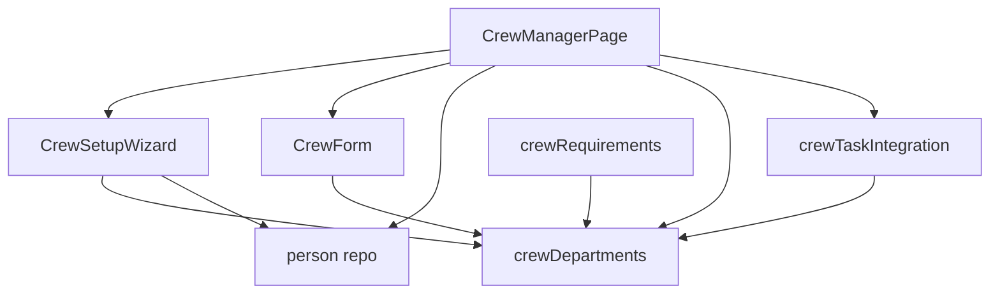
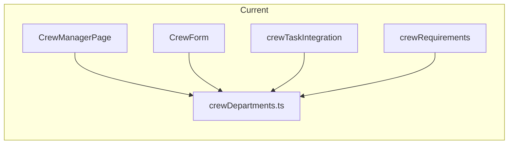
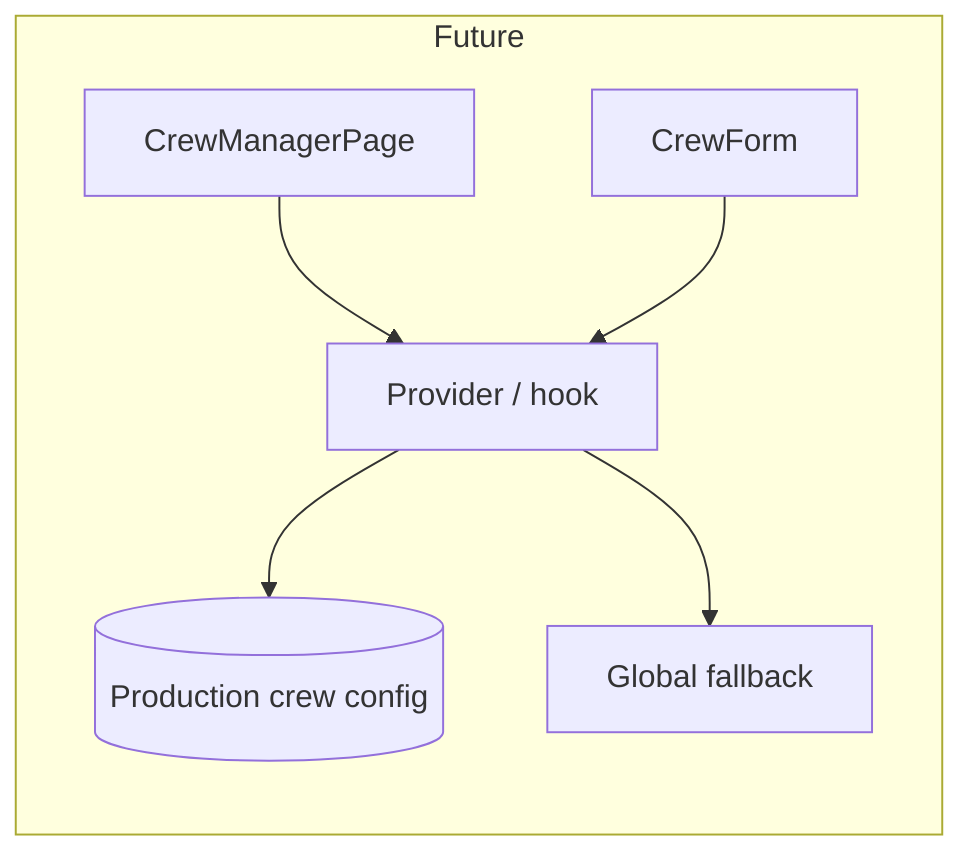

# Crew Manager

This document is both a **user guide** (how to use Crew Manager and the setup wizard) and a **developer guide** (architecture, data flow, and integration points). A final section provides key information to support a future refactor for **project-scoped crew hierarchies and roles**.

---

## Table of contents

**Part I — User guide**

- [1. Overview and purpose](#1-overview-and-purpose)
- [2. First-run setup wizard](#2-first-run-setup-wizard)
- [3. Empty state (no crew)](#3-empty-state-no-crew)
- [4. Main page: summary, filters, and crew table](#4-main-page-summary-filters-and-crew-table)
- [5. Add and edit crew](#5-add-and-edit-crew)
- [6. Crew detail page](#6-crew-detail-page)
- [7. Connections to Tasks and Call sheets](#7-connections-to-tasks-and-call-sheets)

**Part II — Developer guide**

- [8. Architecture and file layout](#8-architecture-and-file-layout)
- [9. Data model (no crew-specific schema)](#9-data-model-no-crew-specific-schema)
- [10. Wizard trigger and behaviour](#10-wizard-trigger-and-behaviour)
- [11. Query keys and invalidation](#11-query-keys-and-invalidation)
- [12. Task and call-sheet integration (read-only)](#12-task-and-call-sheet-integration-read-only)

**Part III — Reference**

- [13. Router and navigation](#13-router-and-navigation)
- [14. Canonical hierarchy reference](#14-canonical-hierarchy-reference)
- [15. File and route reference](#15-file-and-route-reference)

**Part IV — Supporting project-scoped crew hierarchy (future refactor)**

- [16. Current state: global hierarchy](#16-current-state-global-hierarchy)
- [17. Concepts for project-scoped customisation](#17-concepts-for-project-scoped-customisation)
- [18. Suggested reference diagram (future)](#18-suggested-reference-diagram-future)

---

## Part I — User guide

### 1. Overview and purpose

- **Purpose:** Crew Manager is the production-scoped hub for managing **crew** (non-cast): departments, roles, Heads of Department (HODs), and contact details. It aligns with a canonical crew hierarchy used for task responsibility and call sheets.
- **Route:** `/people/crew-manager` (see [src/app/router.tsx](src/app/router.tsx)).
- **Navigation:** People → Crew Manager ([src/app/navigation.ts](src/app/navigation.ts)).
- **Context:** Requires a current production; shows "Select a production first." if none selected.
- **Scope:** All crew are scoped to the current production (`people.production_id`). Department and role use the **canonical hierarchy** (see [src/lib/people/crew-departments.md](src/lib/people/crew-departments.md) and [src/lib/people/crewDepartments.ts](src/lib/people/crewDepartments.ts)).

### 2. First-run setup wizard

- **When it appears:** Automatically the first time you open Crew Manager for a production that has **no crew** (zero crew records). It does not appear if the production already has any crew.
- **Flow:**
  1. **Intro step:** Title "Set up your crew" and short explanation of what Crew Manager does (organise by department, assign HODs, contacts, tasks and call sheets). Actions: **Start setup** or **Skip for now**.
  2. **Setup step:** List of canonical departments; you can select which departments to set up and, for each, enter the Head of Department (name, role defaulting to that department's HOD role, email, phone). Actions: **Add selected HODs** (creates crew records), **Finish**, **Skip for now**, **Back**.
- **Skip / close:** You can skip or close the wizard at any time; Crew Manager remains usable with the empty state (see below). The wizard does not block use of the page.
- **Data:** Crew created in the wizard are normal crew records (same as "Add crew"); HOD status is derived from department + role using the canonical hierarchy.

### 3. Empty state (no crew)

- When the production has no crew, the main content shows an **empty state** card: short description of Crew Manager and two actions:
  - **Start setup** — opens the setup wizard.
  - **Add crew manually** — opens the standard Add crew dialog.
- The summary strip still shows (all zeros). Search and filters are hidden until crew exist.

### 4. Main page: summary, filters, and crew table

- **Summary strip:** Crew count, department count, HOD count, missing department count, missing role count.
- **Department task responsibility (when tasks exist):** Table of departments with open/overdue task counts and assigned HOD. Surfaces departments with open tasks but no HOD.
- **Toolbar:** Search (name, department, role, email, phone), filters (department, HOD only / non-HOD, missing department / role).
- **Crew table:** Name (link to crew detail), department, role, HOD badge (with task counts when relevant), phone, email, actions (view, edit). Sorted by canonical department order, then HOD first, then role order, then name.
- **Add crew:** Header button opens the Add crew dialog (same form as editing).

### 5. Add and edit crew

- **Add:** "Add crew" in header or "Add crew manually" in empty state. Dialog with [CrewForm](src/features/people/components/CrewForm.tsx): name (required), department (canonical list), role (department-dependent list), email, phone, phases, notes. Department and role are required together; role list includes the HOD role for that department.
- **Edit:** Pencil icon on a row opens the same form pre-filled. No separate "wizard-only" path; all crew are created/updated via the same repository and form.

### 6. Crew detail page

- **Route:** `/people/crew/:personId` ([CrewDetailPage](src/features/people/pages/CrewDetailPage.tsx)).
- **Access:** From Crew Manager, click a crew name or the view (eye) icon.
- **Content:** Crew-focused profile: department, role, HOD badge, contact, bookings summary, department task context, notes. Back link to Crew Manager.

### 7. Connections to Tasks and Call sheets

- **Tasks:** Department task responsibility on Crew Manager and crew detail uses [crewTaskIntegration](src/lib/people/crewTaskIntegration.ts): crew departments map to task `assigned_department` values (e.g. Lighting → Electrical). HODs are responsible for departmental task completion; the table shows open/overdue counts and highlights departments with tasks but no HOD.
- **Call sheets:** Call-sheet crew lists ([crewRequirements.ts](src/lib/call-sheets/crewRequirements.ts)) use the same canonical hierarchy: crew booked on a shoot day are grouped by department with HOD first, then canonical role order.

---

## Part II — Developer guide

### 8. Architecture and file layout

- **Feature UI:** [src/features/people/crew-manager/](src/features/people/crew-manager/): [page.tsx](src/features/people/crew-manager/page.tsx) (CrewManagerPage), [CrewSetupWizard.tsx](src/features/people/crew-manager/CrewSetupWizard.tsx).
- **Shared form:** [src/features/people/components/CrewForm.tsx](src/features/people/components/CrewForm.tsx) (CrewFormValues, crewFormSchema, department/role selects from canonical hierarchy).
- **Crew detail:** [src/features/people/pages/CrewDetailPage.tsx](src/features/people/pages/CrewDetailPage.tsx).
- **Canonical hierarchy:** [src/lib/people/crewDepartments.ts](src/lib/people/crewDepartments.ts) — single source of truth for department names, HOD roles, ordered roles, and crew→task department mapping.
- **Task integration (read-only):** [src/lib/people/crewTaskIntegration.ts](src/lib/people/crewTaskIntegration.ts) — getTasksForCrewDepartment, getTaskSummaryForCrewDepartment, getHodResponsibilitySummary, getDepartmentsWithTasksButNoHod.
- **Call-sheet crew:** [src/lib/call-sheets/crewRequirements.ts](src/lib/call-sheets/crewRequirements.ts) — getCallSheetCrewRequirements (grouped by department, HOD first).
- **Data:** [src/lib/db/repositories/person.ts](src/lib/db/repositories/person.ts) — listCrew(productionId), createPerson, updatePerson, getPersonById.

### 9. Data model (no crew-specific schema)

- **Crew = people with `is_cast = 0`.** Person ([src/lib/db/types.ts](src/lib/db/types.ts)): id, production_id, name, is_cast, department (string), role_name (string), email, phone, phases, notes, etc.
- **HOD is derived:** Not stored. A person is HOD for a department if `person.department` matches a canonical department and `person.role_name` equals that department's `hodRole` in [crewDepartments.ts](src/lib/people/crewDepartments.ts) (see `isHodRole`, `getHodRoleForDepartment`).
- **Empty-state condition:** Wizard and empty-state UI use `listCrew(currentProductionId)`; "no crew" means the returned array length is 0.

### 10. Wizard trigger and behaviour

- **Trigger:** In [page.tsx](src/features/people/crew-manager/page.tsx), a `useEffect` runs when `currentProductionId` is set, crew query has loaded (`!crewLoading`), and `crew.length === 0`. A ref (`hasAutoOpenedWizardRef`) ensures the wizard auto-opens only once per production per visit; switching production resets the ref so the wizard can show again for another production with no crew.
- **Wizard does not persist "dismissed".** No schema field; behaviour is local to the page and session.
- **Create path:** Wizard calls `onCreateCrew(values: CrewFormValues)`; the page passes `createMutation.mutateAsync(values)`, so each HOD is created via the same `createPerson` path as "Add crew".

### 11. Query keys and invalidation

- Crew list: `['crew', currentProductionId]`. Invalidated after create/update person (and by duplicate production, etc.).
- Tasks: `['tasks', currentProductionId]` (used for department task responsibility).

### 12. Task and call-sheet integration (read-only)

- **Task departments:** Tasks use `assigned_department` from [PRODUCTION_DEPARTMENTS](src/lib/productions/departments.ts). [CREW_TO_TASK_DEPARTMENT_MAP](src/lib/people/crewDepartments.ts) maps each canonical crew department to one or more task department labels (e.g. Lighting → Electrical, Art → Art Department). crewTaskIntegration uses this map to filter tasks by crew department and to build the HOD responsibility table.
- **Call sheets:** crewRequirements filters crew by booking for the shoot day, groups by canonical department, and orders within each group: HOD first, then canonical role order from C1.

---

## Part III — Reference

### 13. Router and navigation

- **Routes:** `people/crew-manager` → CrewManagerPage; `people/crew/:personId` → CrewDetailPage. The crew detail route is declared **before** `people/:personId` so "crew" is not interpreted as a personId.
- **Nav:** People submenu, "Crew Manager" with link to `/people/crew-manager`.

### 14. Canonical hierarchy reference

- **Human-readable list:** [src/lib/people/crew-departments.md](src/lib/people/crew-departments.md).
- **Code:** [src/lib/people/crewDepartments.ts](src/lib/people/crewDepartments.ts) — CREW_DEPARTMENTS, getCrewDepartmentNames(), getHodRoleForDepartment(), getCrewRolesForDepartment(), isHodRole(), CREW_TO_TASK_DEPARTMENT_MAP, getTaskDepartmentsForCrewDepartment().

| Canonical crew department | Task department (PRODUCTION_DEPARTMENTS) |
|---------------------------|----------------------------------------|
| Development               | Producers, Direction                    |
| Production                | Production                             |
| Finance                   | Accounts                               |
| Locations                 | Locations                              |
| Art                       | Art Department                         |
| Camera                    | Camera                                 |
| Lighting                  | Electrical                             |
| Grip                      | Grip                                   |
| Sound                     | Sound                                  |
| Post-Production           | Post Production                        |

### 15. File and route reference

| Path | Purpose |
|------|--------|
| [src/features/people/crew-manager/page.tsx](src/features/people/crew-manager/page.tsx) | Main Crew Manager page: list, filters, summary, task responsibility, add/edit dialog, wizard trigger. |
| [src/features/people/crew-manager/CrewSetupWizard.tsx](src/features/people/crew-manager/CrewSetupWizard.tsx) | First-run setup wizard (intro + departments/HODs step). |
| [src/features/people/components/CrewForm.tsx](src/features/people/components/CrewForm.tsx) | Add/edit crew form: name, department, role, contact, phases, notes. |
| [src/features/people/pages/CrewDetailPage.tsx](src/features/people/pages/CrewDetailPage.tsx) | Crew profile page at `/people/crew/:personId`. |
| [src/lib/people/crewDepartments.ts](src/lib/people/crewDepartments.ts) | Canonical hierarchy: departments, HOD roles, ordered roles, crew→task mapping. |
| [src/lib/people/crew-departments.md](src/lib/people/crew-departments.md) | Human reference for departments and roles (kept in sync with TS). |
| [src/lib/people/crewTaskIntegration.ts](src/lib/people/crewTaskIntegration.ts) | Task summaries by crew department, HOD responsibility, departments with tasks but no HOD. |
| [src/lib/call-sheets/crewRequirements.ts](src/lib/call-sheets/crewRequirements.ts) | Call-sheet crew grouping by department, HOD first, canonical role order. |
| [src/lib/db/repositories/person.ts](src/lib/db/repositories/person.ts) | listCrew(productionId), createPerson, updatePerson, getPersonById. |

---

## Part IV — Supporting project-scoped crew hierarchy (future refactor)

This section gives implementers enough context to add **per-production (project) customisation** of crew departments and roles. No schema or code changes are specified here; it is reference for planning the refactor.

### 16. Current state: global hierarchy

- **Single source of truth:** [crewDepartments.ts](src/lib/people/crewDepartments.ts) defines a **global** list: CREW_DEPARTMENT_NAMES, CREW_DEPARTMENTS (name, hodRole, roles), and CREW_TO_TASK_DEPARTMENT_MAP. No production_id or project scope; the same hierarchy applies to all productions.
- **Consumers that read this module:**
  - Crew Manager page (department filter, summary, sorting, HOD derivation).
  - CrewSetupWizard (department list, HOD role default).
  - CrewForm (department and role dropdowns).
  - CrewDetailPage (HOD badge, department context).
  - crewTaskIntegration (department list, HOD check, task department mapping).
  - crewRequirements (call-sheet grouping and ordering).
- **Person storage:** `people.department` and `people.role_name` are free-form strings; validation and UI options currently come from the global hierarchy. All crew share the same production-scoped list of people (`listCrew(productionId)`).

### 17. Concepts for project-scoped customisation

- **Goal:** Allow each production to define (or override) its own set of departments, HOD roles, and ordered roles (and optionally the mapping to task departments), so that different projects can use different structures (e.g. different department names or role sets).
- **Key points for implementation:**
  1. **Where to store config:** New tables or JSON blobs keyed by `production_id` (e.g. `production_crew_config` or normalized `production_crew_departments` + `production_crew_roles`). Default/fallback to current global hierarchy when no production config exists.
  2. **API shape:** Either repository functions that return hierarchy for a given production (e.g. `getCrewDepartmentsForProduction(productionId)`) or a context/hook that provides the effective hierarchy for the current production. All current call sites that use `getCrewDepartmentNames()`, `getCrewRolesForDepartment()`, `getHodRoleForDepartment()`, etc. would need to receive a production-scoped hierarchy (or productionId) instead of using the global module directly.
  3. **Backward compatibility:** Existing productions keep using the global hierarchy until they have an explicit config (or migration). New productions could start with a copy of the global hierarchy or empty config that falls back to global.
  4. **Task mapping:** CREW_TO_TASK_DEPARTMENT_MAP is currently global. Per-project customisation may require per-production mapping (or fallback to global) so that task department filters and HOD responsibility still align.
  5. **Validation:** CrewForm and CrewSetupWizard validate department/role against the effective hierarchy; that hierarchy would become production-scoped. Existing crew with department/role strings that no longer exist in the project's hierarchy could be handled as "Other" or legacy (document the chosen behaviour).

### 18. Suggested reference diagram (future)

**Current flow:** All consumers call the single [crewDepartments](src/lib/people/crewDepartments.ts) module (global constants and functions). No production_id is passed.

**Future flow (conceptual):** Consumers call a production-scoped provider (e.g. hook or context that takes `currentProductionId`). The provider loads hierarchy from DB for that production or falls back to the global default. Same function names (getCrewDepartmentNames, getHodRoleForDepartment, etc.) but backed by production-specific data when configured.

