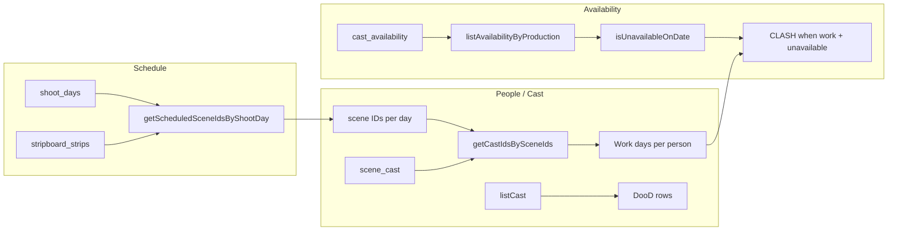

# People, Booking & Day out of Days (DooD)

**User guide and technical reference.**

This document has two parts: a **user guide** (how to use the People area and Cast Manager in Albatross) and a **technical reference** (current state, dependencies, refactor impact, and file reference). It describes the People, Booking, and Day-out-of-Days (DooD) systems and dependencies that may be affected by refactors.

---

## Table of contents

**Part 0 — User guide**

- [1. What the People area is for](#1-what-the-people-area-is-for)
- [2. Getting around: Bookings, Day Out of Days, Cast Manager](#2-getting-around-bookings-day-out-of-days-cast-manager)
- [3. Cast Manager: managing cast and roles](#3-cast-manager-managing-cast-and-roles)
- [4. People list: cast and crew in one place](#4-people-list-cast-and-crew-in-one-place)
- [5. Bookings and Day Out of Days](#5-bookings-and-day-out-of-days)
- [6. Person detail: single-person hub](#6-person-detail-single-person-hub)

**Part I — Current state**

- [1. Overview and purpose](#1-overview-and-purpose)
- [2. People (Cast) list page](#2-people-cast-list-page)
- [3. Cast Manager](#3-cast-manager)
- [4. Person detail (People hub)](#4-person-detail-people-hub)
- [5. Scene and shot participation](#5-scene-and-shot-participation)
- [6. Bookings](#6-bookings)
- [7. Booking intelligence](#7-booking-intelligence)
- [8. Day out of Days (DooD)](#8-day-out-of-days-dood)
- [9. Router and navigation](#9-router-and-navigation)
- [10. Data flow: DooD work days and clashes](#10-data-flow-dood-work-days-and-clashes)

**Part II — Dependencies and refactor impact**

- [10. Outbound dependencies](#10-outbound-dependencies)
- [11. Inbound dependencies](#11-inbound-dependencies)
- [12. Shared libs: bookingsSummary and bookingIntelligence](#12-shared-libs-bookingssummary-and-bookingintelligence)
- [13. Database and types](#13-database-and-types)
- [14. Checklist for refactors](#14-checklist-for-refactors)

**Part III — Reference**

- [15. File and route reference](#15-file-and-route-reference)
- [16. Legacy pages](#16-legacy-pages)

---

## Part 0 — User guide

### 1. What the People area is for

The People area is the hub for everyone on your production: **cast and crew**. It covers who they are (names, contact and agent details, roles), which **scenes and shots** they appear in, which **shoot days** they are assigned to (**bookings**), and the **Day out of Days** view of who works when. Everything is scoped to the current production.

### 2. Getting around: Bookings, Day Out of Days, Cast Manager

In the app, **People** in the main navigation opens a submenu with three entries:

- **Bookings** — See and manage who is assigned to which shoot days. This is the default People landing page.
- **Day Out of Days** — A matrix of cast × shoot days (WORK, HOLD, OFF, CLASH) with PDF/CSV export.
- **Cast Manager** — A cast-only list where you add and edit cast members, assign roles (e.g. character names), and manage agent and contact info.
- **Crew Manager** — A crew-only list for departments, roles, HOD status, and crew availability.

Open cast or crew person detail from the respective manager; the back arrow returns to that manager (not a combined People list).

### 3. Cast Manager: managing cast and roles

**Cast Manager** is for **cast only** (no crew). Use it to:

- **View** all cast in one table (cast number, name, role, agent, contact, contributor form status).
- **Search** by name, role, cast number, or agent name.
- **Filter** by contributor form status or by missing data (missing role, missing cast number, missing agent info).
- **See summary counts** at the top: total cast, how many are missing cast number, role, or agent info.
- **Add cast** — “Add cast” opens a cast-specific form; new records are always saved as cast.
- **Edit cast** — Use the edit action on a row to update that cast member in the same form.
- **Record unavailable dates** — Use the calendar icon on a row (or cast person detail) to enter single days or date ranges when a cast member cannot work. These appear as **CLASH** in Day Out of Days when they are scheduled to work on an unavailable day.

The form is organised into: **Identity** (name, cast number, role), **Direct contact** (email, phone), **Agent** (name, email, phone), and **Production / admin** (contributor form status, phases, notes). Cast Manager uses the same underlying people data as the rest of the app (Call Sheets, scene/shot participation, etc.); there is no separate cast system.

### 4. Legacy People list (redirect only)

The legacy combined People list at `/people/cast` is **not** in the sidebar. That URL redirects to **Cast Manager**. Use **Cast Manager** for cast and **Crew Manager** for crew.

### 5. Bookings and Day Out of Days

- **Bookings** — Assign people to shoot days. The page shows calendar and list views, and **booking intelligence** highlights who is needed but not yet booked (or booked but not needed) based on the schedule and scene/shot participation.
- **Day Out of Days** — See who works when. Work days are derived from the schedule (stripboard) and scene participation, not from bookings. Export to PDF or CSV.

### 6. Person detail: single-person hub

Opening a person from **Cast Manager** (`/people/:personId`, back → Cast Manager) or **Crew Manager** (`/people/crew/:personId`, back → Crew Manager) takes you to person detail. There you see summary cards (bookings count, next booked, clashes, DooD work days for cast), the list of their bookings, booking need summary, **unavailable dates** (editable), **Scene participation** (which scenes they are in), **Shot participation** (which shots; cast only), Day out of Days summary (cast), and recent activity. Crew person detail also supports unavailable dates (crew-only; not shown in DooD). You can edit the person via the edit dialog.

---

## Part I — Current state

### 1. Overview and purpose

- **Purpose:** The People section is the hub for cast and crew, their **scene and shot participation**, their **bookings** (which shoot days they are assigned to), **booking intelligence** (who is needed vs booked), and the **Day out of Days (DooD)** matrix showing who works when and availability clashes.
- **Three distinct concepts:**
  1. **Scene participation (`scene_cast`)** — Scene-level source of truth: which cast members are in which scenes. DooD work days are derived from scheduled stripboard scenes + `scene_cast`.
  2. **Shot participation (`shot_cast`)** — Refinement layer: which cast members are in which shots within a scene. Used for scheduling intelligence and future logic; **DooD does not use `shot_cast`**.
  3. **Bookings** — Operational assignment of a person to a shoot day. Stored in `bookings`; not used by DooD for work-day derivation.
- **Routes:** `/people` redirects to `/people/bookings`. Child routes: `/people/bookings`, `/people/day-out-of-days`, `/people/cast-manager`, `/people/crew-manager`, `/people/crew/:personId` (crew detail), `/people/:personId` (cast detail). `/people/cast` redirects to Cast Manager (legacy URL, not in nav).
- **Navigation:** "People" (Users icon) in app nav with sub-items: **Bookings**, **Day Out of Days**, **Cast Manager**, and **Crew Manager**. Cast detail is reached via `/people/:personId` (e.g. from Cast Manager); crew detail via `/people/crew/:personId` (from Crew Manager). Detail back arrows return to the respective manager.
- **Cast and roles:** Cast records can store a **role** (e.g. character name) in the `role_name` field on the person record. Cast Manager is the main place to manage cast and roles; the generic People list also supports `role_name` for compatibility.
- **Context:** All pages require a current production via `useCurrentProduction()`. Data is scoped by `production_id`.

### 2. People (Cast) list page (legacy, not user-facing)

- **Route:** `/people/cast` redirects to `/people/cast-manager`.
- **File:** [src/features/people/page.tsx](src/features/people/page.tsx).
- **Purpose:** Generic list of **all** people (cast and crew) for the production; filter by all/crew/cast; create, edit, delete persons. Rows can link to Person detail (`/people/:personId`). Distinct from **Cast Manager**, which is cast-only and role-focused.
- **Form fields:** name, is_cast, email, phone, department, phases, notes, contributor_form_status; for cast: **cast_number**, **role_name**, **agent_name**, **agent_email**, **agent_phone** (role_name supported for compatibility).
- **Data:** `Person` type in [src/lib/db/types.ts](src/lib/db/types.ts). Repository: [src/lib/db/repositories/person.ts](src/lib/db/repositories/person.ts) — `listPeopleByProduction`, `listCast`, `createPerson`, `updatePerson`, `deletePerson`. Table: `people` (production-scoped, `is_cast` flag).

### 3. Cast Manager

- **Route:** `/people/cast-manager`.
- **Files:** [src/features/people/pages/CastManagerPage.tsx](src/features/people/pages/CastManagerPage.tsx), [src/features/people/components/CastForm.tsx](src/features/people/components/CastForm.tsx).
- **Purpose:** Cast-only management: list cast, search (name, role, cast number, agent), filter (contributor form status; missing role, cast number, or agent info), summary cards (total cast, missing data counts), **add cast** and **edit cast** via a cast-specific form. No crew; no cast/crew toggle in the form.
- **Data:** Same `Person` type and `listCast` / `createPerson` / `updatePerson`; `role_name` on person. Create flow always sets `is_cast = 1`; edit flow does not change `is_cast` so cast remain cast.
- **Form (CastForm):** Sections — **Identity** (name, cast number, role), **Direct contact** (email, phone), **Agent** (name, email, phone), **Production / admin** (contributor form status, phases, notes). Validation: name required; email and agent email valid if provided; contributor form status one of the allowed enum values.

### 4. Person detail (People hub)

- **Route:** `/people/:personId`.
- **File:** [src/features/people/pages/CastDetailPage.tsx](src/features/people/pages/CastDetailPage.tsx).
- **Purpose:** Single-person hub: summary cards (bookings count, next booked, clashes, DooD work days), **Bookings** section (list of bookings + link to Bookings page), **booking need summary** (days needed, days booked, missing, booked but not needed from [bookingIntelligence](#12-shared-libs-bookingssummary-and-bookingintelligence)), **Availability**, **Scene participation** (scene_cast: add/remove scenes), **Shot participation** (shot_cast: add/remove shots; cast only), **Day out of Days** summary (first/last work day, work days, clashes), **Recent activity**. Edit person via dialog.
- **Data:** Person, bookings (listBookingsByPerson), availability, scene_cast (listSceneCastByPerson), shot_cast (listShotCastByPersonInProduction), shoot days, scheduled scenes per day, getPersonBookingsSummary, getPersonBookingNeedSummary.

### 5. Scene and shot participation

- **Scene participation (`scene_cast`):**
  - **Source of truth** for “this cast member is in this scene.” Used by DooD to derive work days (scheduled scenes per day → cast on those scenes).
  - Table: `scene_cast` (production_id, scene_id, person_id). Repository: [src/lib/db/repositories/scene-cast.ts](src/lib/db/repositories/scene-cast.ts) — `listSceneCastByScene`, `listSceneCastByPerson`, `addSceneCast`, `removeSceneCast`, `getCastIdsBySceneIds`.
- **Shot participation (`shot_cast`):**
  - **Refinement layer**: “this cast member is in these specific shots” within a scene. **DooD does not use `shot_cast`**; work days are still derived only from scene_cast + stripboard.
  - When adding a person to a shot, the system ensures they are on the parent scene (adds `scene_cast` if missing) so scene- and shot-level participation stay consistent.
  - Table: `shot_cast` (production_id, shot_id, person_id). Repository: [src/lib/db/repositories/shot-cast.ts](src/lib/db/repositories/shot-cast.ts) — `listShotCastByShot`, `listShotCastByPersonInProduction`, `addShotCast`, `removeShotCast`, `getCastIdsByShotIds`, `listShotCastByShotIds`.
  - **UI:** Person detail has a “Shot participation” section (cast only); Schedule → Shot list has per-shot cast with add/remove.
- **Duplicate production:** Both `scene_cast` and `shot_cast` are copied (using scene/shot/person id maps). Bookings are **not** copied.

### 6. Bookings

- **Active UI:** [src/features/people/pages/BookingsPage.tsx](src/features/people/pages/BookingsPage.tsx). Route: `/people/bookings`.
- **Purpose:** Calendar and list views of who is booked on which shoot days; filter by unit, department, cast/crew; create and delete bookings (person + shoot day). **Booking intelligence** (see below) surfaces needed-but-not-booked and booked-but-not-needed as advisory only; no automatic booking creation.
- **Data:** `Booking` type in [src/lib/db/types.ts](src/lib/db/types.ts): `production_id`, `person_id`, `shoot_day_id` (nullable), `start_date`, `end_date`, `role`, `notes`. Repository: [src/lib/db/repositories/booking.ts](src/lib/db/repositories/booking.ts). Table: `bookings` with FK to `people(id)`; `shoot_day_id` references `shoot_days(id)` (e.g. ON DELETE SET NULL per migrations).
- **Duplicate production:** When a production is duplicated via [src/lib/db/duplicateProduction.ts](src/lib/db/duplicateProduction.ts), **bookings are not copied**. The new production starts with no bookings.

### 7. Booking intelligence

- **Purpose:** Read-only, advisory layer that compares **scheduled scenes/shots** + **scene_cast/shot_cast** with **bookings** to show who is needed vs booked, missing bookings, and unnecessary bookings. **Does not create or change bookings.**
- **File:** [src/lib/people/bookingIntelligence.ts](src/lib/people/bookingIntelligence.ts).
- **Rules:**
  - **Needed on day:** Person is in `scene_cast` for at least one scheduled scene that day, **or** (when the day has scheduled shots) in `shot_cast` for at least one scheduled shot. **Precedence:** if the day has scheduled shots, use `shot_cast` for those shots; otherwise use `scene_cast` for scheduled scenes.
  - **Booked on day:** A booking exists for that person and shoot day.
  - **Needed but not booked / Booked but not needed / Properly booked:** Derived from the above.
- **APIs:** `getBookingCoverageByShootDay(productionId)` (per-day coverage, totals); `getPersonBookingNeedSummary(productionId, personId)` (days needed, booked, missing, unnecessary).
- **Stripboard:** Uses `getScheduledSceneIdsByShootDay` and `getScheduledShotIdsByShootDay` from [stripboard-strips](src/lib/db/repositories/stripboard-strips.ts).
- **Consumers:** Bookings page (summary card, calendar badges, list view status and “Needed but not booked” section with “Add booking” links); Person detail (booking need summary in Bookings section).

### 8. Day out of Days (DooD)

- **Active UI:** [src/features/people/pages/DayOutOfDaysPage.tsx](src/features/people/pages/DayOutOfDaysPage.tsx). Route: `/people/day-out-of-days`.
- **Purpose:** Matrix of cast (rows) × shoot days (columns) with cell status: WORK (scheduled to work), HOLD (on hold), OFF (not working), CLASH (scheduled to work but marked unavailable). Export to PDF and CSV.
- **Data source (important):** DooD does **not** use the `bookings` table or `shot_cast` for work days. Work days are **derived only** from:
  - Shoot days → which **scenes** are scheduled per day (`getScheduledSceneIdsByShootDay` from stripboard_strips).
  - Those scenes → which cast are on them (`getCastIdsBySceneIds` from **scene_cast**).
  - Result: which people “work” on which dates. Clashes come from `cast_availability`: if a person is scheduled to work (from stripboard + scene_cast) but has an UNAVAILABLE range covering that date, the cell is CLASH.
- **Types:** `CastAvailability`, `CastAvailabilityStatus`, `SceneCast` in [src/lib/db/types.ts](src/lib/db/types.ts). Repositories: [cast-availability](src/lib/db/repositories/cast-availability.ts), [scene-cast](src/lib/db/repositories/scene-cast.ts), [stripboard-strips](src/lib/db/repositories/stripboard-strips.ts). PDF export: [src/lib/pdf/dood.ts](src/lib/pdf/dood.ts).

### 9. Router and navigation

- **Router:** [src/app/router.tsx](src/app/router.tsx) — `/people` → Navigate to `/people/bookings`; `/people/bookings` → BookingsPage; `/people/day-out-of-days` → DayOutOfDaysPage; `/people/cast-manager` → CastManagerPage; `/people/crew-manager` → CrewManagerPage; `/people/crew/:personId` → CrewDetailPage (back → Crew Manager); `/people/cast` → redirect to Cast Manager; `/people/:personId` → CastDetailPage (back → Cast Manager; crew records redirect to `/people/crew/:personId`).
- **Navigation:** [src/app/navigation.ts](src/app/navigation.ts) — People group with `defaultChild: '/people/bookings'`, sub-items "Bookings", "Day Out of Days", "Cast Manager", and "Crew Manager". No sidebar entry for `/people/cast`.

### 10. Data flow: DooD work days and clashes

- **Booking vs DooD:** Bookings = explicit rows in the `bookings` table (person + shoot_day). DooD “work” = derived from stripboard + **scene_cast only** (no shot_cast, no bookings). Refactoring the bookings table or UI does not change how DooD computes work days; it can still affect Budget’s bookings summary and any PDF that uses booking data.

---

## Part II — Dependencies and refactor impact

### 10. Outbound dependencies

(What People / Booking / DooD use; these must remain available or be updated in sync.)

- **Productions context:** `useCurrentProduction()` from [src/features/productions/context](src/features/productions/context). All UIs are production-scoped.
- **Schedule:** `shoot_days`, `shoot_day_units`, `stripboard_strips`, `scenes`, `shots` — BookingsPage uses units and shoot days; DayOutOfDaysPage uses shoot days and scheduled scenes per day; Person detail and booking intelligence use shoot days and strips; Shot list and shot_cast use shots.
- **Stripboard:** `getScheduledSceneIdsByShootDay`, `getScheduledShotIdsByShootDay` — DooD uses only scene-by-day; booking intelligence uses both for needed-on-day.
- **Scene and shot cast:** `scene_cast`, `shot_cast` — DooD uses only scene_cast; booking intelligence uses shot_cast when scheduled shots exist for a day, else scene_cast.
- **Shared UI:** `@/components/ui/*` (tables, dialogs, buttons, selects, etc.).

### 11. Inbound dependencies

(Other features that use People-related data; refactors here can break them.)

| Consumer | What they use | Risk if People/Booking refactor |
|----------|----------------|----------------------------------|
| **Budget – Labour** | `Person`; `person_id` on labour line items and labour expense transactions; **getPersonBookingsSummary** from [src/lib/people/bookingsSummary.ts](src/lib/people/bookingsSummary.ts) in [LabourTransactionEditor](src/features/budget/typed-expense-views/LabourTransactionEditor.tsx) to show booked days summary | Changing `Booking` shape or repository (`listBookingsByProduction`, shoot days) can break bookings summary. Changing `Person` or person repo can break labour person picker/display. |
| **Budget – general** | [Budget page](src/features/budget/page.tsx) uses `listPeopleByProduction` for a people query | Renaming/removing person repo or type affects Budget. |
| **Call Sheets** | [src/features/call-sheets/page.tsx](src/features/call-sheets/page.tsx) uses `listCast` and scheduled scenes/cast | Person repo or scene_cast/cast data shape changes can affect call sheets. |
| **PDF export** | [src/lib/pdf/index.ts](src/lib/pdf/index.ts) references `person_id` on bookings (e.g. `data.people`, `b.person_id`) | Booking or people data shape changes can break PDF generation. |
| **Duplicate production** | [src/lib/db/duplicateProduction.ts](src/lib/db/duplicateProduction.ts) copies `people`, `scene_cast`, `shot_cast`, `cast_availability`; does **not** copy `bookings` | Any refactor that moves or renames these tables/repos must update duplication; adding booking copy would be a separate product decision. |
| **Schedule – Shot list** | [src/features/schedule/shot-list-page.tsx](src/features/schedule/shot-list-page.tsx) uses scene_cast and shot_cast repos for “Cast in this scene” and per-shot cast | Changing scene_cast/shot_cast repos or types affects Shot list page. |

### 12. Shared libs: bookingsSummary and bookingIntelligence

- **bookingsSummary** — [src/lib/people/bookingsSummary.ts](src/lib/people/bookingsSummary.ts).
  - **API:** `getPersonBookingsSummary(productionId, personId)` → `Promise<PersonBookingsSummary>` with `{ booked_days_count, start_date, end_date }`.
  - **Implementation:** Uses `listBookingsByProduction`, `listShootDaysByProduction`; filters bookings by `person_id`, resolves shoot_day_id to date.
  - **Importers:** Budget’s [LabourTransactionEditor](src/features/budget/typed-expense-views/LabourTransactionEditor.tsx); Person detail page. This is the **main contractual boundary** between People/Booking and Budget for “booked days” summary.
- **bookingIntelligence** — [src/lib/people/bookingIntelligence.ts](src/lib/people/bookingIntelligence.ts).
  - **API:** `getBookingCoverageByShootDay(productionId)`, `getPersonBookingNeedSummary(productionId, personId)`. Read-only; no DB writes.
  - **Importers:** Bookings page (coverage, missing/extra, status); Person detail (need summary). DooD does **not** use this layer.

### 13. Database and types

- **Tables:** `people`, `bookings`, `cast_availability`, **`crew_availability`**, `scene_cast`, **`shot_cast`**; plus schedule tables `shoot_days`, `shoot_day_units`, `stripboard_strips`, `scenes`, `shots`. FK and cascade: see migrations (e.g. [src-tauri/migrations/0004_fk_cascade_refactor.sql](src-tauri/migrations/0004_fk_cascade_refactor.sql) and later migrations for shot_cast) — people → scene_cast, shot_cast, cast_availability, crew_availability, bookings (CASCADE); bookings.shoot_day_id SET NULL on delete.
- **Shared types** in [src/lib/db/types.ts](src/lib/db/types.ts): `Person` (including cast_number, **role_name** (string | null — cast role/character name; nullable for crew or when unset), agent_name, agent_email, agent_phone), `Booking`, `CastAvailability`, `CastAvailabilityStatus`, `SceneCast`, **`ShotCast`**. Used across People, Budget, Schedule, Call Sheets, and PDF/duplicate logic. Duplicate production copies `role_name` when copying people.

### 14. Checklist for refactors

When changing People, Booking, or DooD:

- **Changing Cast Manager UI or CastForm:** Cast Manager (people/pages/CastManagerPage) and CastForm (people/components/CastForm) use the same person repo and Person type; ensure create always sets `is_cast = 1` and edit does not clear it.
- **Changing Booking / Person or their repositories:** Check LabourTransactionEditor, bookingsSummary, PDF index, duplicateProduction (people/scene_cast/shot_cast/cast_availability).
- **Changing DooD data source (how work days are computed):** DooD uses **only** stripboard + **scene_cast**. Do not switch DooD to shot_cast or bookings without an explicit product decision. Check stripboard_strips, scene_cast, cast_availability repos and types; DooD page and PDF dood module.
- **Changing scene_cast or shot_cast:** Check DooD (scene_cast only), booking intelligence (both, with documented precedence), Person detail, Shot list page, duplicate production.
- **Adding or renaming tables/repos used by duplicate production:** Update [src/lib/db/duplicateProduction.ts](src/lib/db/duplicateProduction.ts) and any ID mapping for the new entities.
- **Changing `getPersonBookingsSummary` contract:** Update LabourTransactionEditor and Person detail (and any other UI that displays booked days summary).
- **Changing booking intelligence APIs or rules:** Update Bookings page and Person detail; keep DooD unchanged.

---

## Part III — Reference

### 15. File and route reference

| Item | Path or route |
|------|----------------|
| Cast Manager page | [src/features/people/pages/CastManagerPage.tsx](src/features/people/pages/CastManagerPage.tsx) — `/people/cast-manager` |
| Crew Manager page | [src/features/people/crew-manager/page.tsx](src/features/people/crew-manager/page.tsx) — `/people/crew-manager` |
| Cast form (cast-specific) | [src/features/people/components/CastForm.tsx](src/features/people/components/CastForm.tsx) — used by Cast Manager only |
| Legacy People list (redirect) | [src/features/people/page.tsx](src/features/people/page.tsx) — `/people/cast` → Cast Manager |
| Cast person detail | [src/features/people/pages/CastDetailPage.tsx](src/features/people/pages/CastDetailPage.tsx) — `/people/:personId` |
| Crew person detail | [src/features/people/pages/CrewDetailPage.tsx](src/features/people/pages/CrewDetailPage.tsx) — `/people/crew/:personId` |
| Bookings page | [src/features/people/pages/BookingsPage.tsx](src/features/people/pages/BookingsPage.tsx) — `/people/bookings` |
| DooD page | [src/features/people/pages/DayOutOfDaysPage.tsx](src/features/people/pages/DayOutOfDaysPage.tsx) — `/people/day-out-of-days` |
| Person repo | [src/lib/db/repositories/person.ts](src/lib/db/repositories/person.ts) |
| Booking repo | [src/lib/db/repositories/booking.ts](src/lib/db/repositories/booking.ts) |
| Scene cast repo | [src/lib/db/repositories/scene-cast.ts](src/lib/db/repositories/scene-cast.ts) |
| Shot cast repo | [src/lib/db/repositories/shot-cast.ts](src/lib/db/repositories/shot-cast.ts) |
| Cast availability repo | [src/lib/db/repositories/cast-availability.ts](src/lib/db/repositories/cast-availability.ts) |
| Crew availability repo | [src/lib/db/repositories/crew-availability.ts](src/lib/db/repositories/crew-availability.ts) |
| Unavailability dialog (cast + crew) | [src/features/people/components/PersonUnavailabilityDialog.tsx](src/features/people/components/PersonUnavailabilityDialog.tsx) |
| Stripboard strips | [src/lib/db/repositories/stripboard-strips.ts](src/lib/db/repositories/stripboard-strips.ts) — `getScheduledSceneIdsByShootDay`, `getScheduledShotIdsByShootDay` |
| Bookings summary lib | [src/lib/people/bookingsSummary.ts](src/lib/people/bookingsSummary.ts) |
| Booking intelligence lib | [src/lib/people/bookingIntelligence.ts](src/lib/people/bookingIntelligence.ts) |
| DooD PDF | [src/lib/pdf/dood.ts](src/lib/pdf/dood.ts) |
| Router | [src/app/router.tsx](src/app/router.tsx) |
| Navigation | [src/app/navigation.ts](src/app/navigation.ts) |

### 16. Legacy pages

The following pages exist but are **not** mounted in the router. They are candidates for removal or consolidation during refactor:

- **[src/features/bookings/page.tsx](src/features/bookings/page.tsx)** — Simpler bookings table (person + shoot day + role, add/delete). The app uses the Bookings page under `people/pages/BookingsPage.tsx` instead.
- **[src/features/day-out-of-days/page.tsx](src/features/day-out-of-days/page.tsx)** — Near-duplicate of the DooD page under `people/pages/DayOutOfDaysPage.tsx`. Same logic (cast, shoot days, stripboard scenes, availability, WORK/HOLD/OFF/CLASH, PDF/CSV). The router only uses the page under `people/pages/`.

Documenting them here avoids confusion and supports a later decision to delete or merge.
