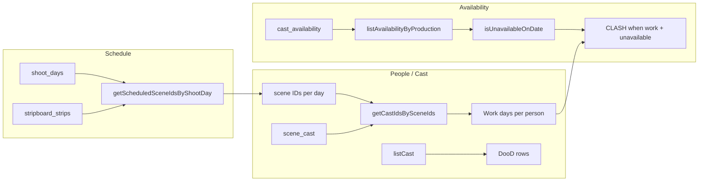

# People, Booking & Day out of Days (DooD)

This document describes the **current state** of the People, Booking, and Day-out-of-Days (DooD) systems and **dependencies** that may be affected by refactors. It is a developer guide for understanding the architecture and assessing impact of changes.

---

## Table of contents

**Part I — Current state**

- [1. Overview and purpose](#1-overview-and-purpose)
- [2. People (Cast) page](#2-people-cast-page)
- [3. Bookings](#3-bookings)
- [4. Day out of Days (DooD)](#4-day-out-of-days-dood)
- [5. Router and navigation](#5-router-and-navigation)
- [6. Data flow: DooD work days and clashes](#6-data-flow-dood-work-days-and-clashes)

**Part II — Dependencies and refactor impact**

- [7. Outbound dependencies](#7-outbound-dependencies)
- [8. Inbound dependencies](#8-inbound-dependencies)
- [9. Shared lib: bookingsSummary](#9-shared-lib-bookingssummary)
- [10. Database and types](#10-database-and-types)
- [11. Checklist for refactors](#11-checklist-for-refactors)

**Part III — Reference**

- [12. File and route reference](#12-file-and-route-reference)
- [13. Legacy pages](#13-legacy-pages)

---

## Part I — Current state

### 1. Overview and purpose

- **Purpose:** The People section is the hub for cast and crew, their bookings (which shoot days they are booked on), and the Day out of Days (DooD) matrix showing who works when and availability clashes.
- **Routes:** `/people` redirects to `/people/bookings`. Child routes: `/people/bookings`, `/people/day-out-of-days`, `/people/cast`.
- **Navigation:** "People" (Users icon) in app nav with sub-items: Bookings, Day Out of Days. The Cast list is reachable at `/people/cast` but is **not** shown in the People sub-nav.
- **Context:** All pages require a current production via `useCurrentProduction()`. Data is scoped by `production_id`.

### 2. People (Cast) page

- **Route:** `/people/cast`.
- **File:** [src/features/people/page.tsx](src/features/people/page.tsx).
- **Purpose:** List all people (cast and crew) for the production; filter by all/crew/cast; create, edit, delete persons. Form fields: name, is_cast, email, phone, department, phases, notes, contributor_form_status.
- **Data:** `Person` type in [src/lib/db/types.ts](src/lib/db/types.ts) (L24–35). Repository: [src/lib/db/repositories/person.ts](src/lib/db/repositories/person.ts) — `listPeopleByProduction`, `listCast`, `createPerson`, `updatePerson`, `deletePerson`. Table: `people` (production-scoped, `is_cast` flag).

### 3. Bookings

- **Active UI:** [src/features/people/pages/BookingsPage.tsx](src/features/people/pages/BookingsPage.tsx). Route: `/people/bookings`.
- **Purpose:** Calendar and list views of who is booked on which shoot days; filter by unit, department, cast/crew; create and delete bookings (person + shoot day).
- **Data:** `Booking` type in [src/lib/db/types.ts](src/lib/db/types.ts) (L465–474): `production_id`, `person_id`, `shoot_day_id` (nullable), `start_date`, `end_date`, `role`, `notes`. Repository: [src/lib/db/repositories/booking.ts](src/lib/db/repositories/booking.ts). Table: `bookings` with FK to `people(id)`; `shoot_day_id` references `shoot_days(id)` with ON DELETE SET NULL (see [src-tauri/migrations/0004_fk_cascade_refactor.sql](src-tauri/migrations/0004_fk_cascade_refactor.sql)).
- **Duplicate production:** When a production is duplicated via [src/lib/db/duplicateProduction.ts](src/lib/db/duplicateProduction.ts), **bookings are not copied**. Only `people`, `scene_cast`, and `cast_availability` are duplicated. The new production starts with no bookings.

### 4. Day out of Days (DooD)

- **Active UI:** [src/features/people/pages/DayOutOfDaysPage.tsx](src/features/people/pages/DayOutOfDaysPage.tsx). Route: `/people/day-out-of-days`.
- **Purpose:** Matrix of cast (rows) × shoot days (columns) with cell status: WORK (scheduled to work), HOLD (on hold), OFF (not working), CLASH (scheduled to work but marked unavailable). Export to PDF and CSV.
- **Data source (important):** DooD does **not** use the `bookings` table for "work" days. Work days are **derived** from the stripboard and scene_cast:
  - Shoot days → which scenes are scheduled per day (`getScheduledSceneIdsByShootDay` from stripboard_strips).
  - Those scenes → which cast are on them (`getCastIdsBySceneIds` from scene_cast).
  - Result: which people "work" on which dates. Clashes come from `cast_availability`: if a person is scheduled to work (from stripboard + scene_cast) but has an UNAVAILABLE range covering that date, the cell is CLASH.
- **Types:** `CastAvailability`, `CastAvailabilityStatus`, `SceneCast` in [src/lib/db/types.ts](src/lib/db/types.ts) (L378–395). Repositories: [cast-availability](src/lib/db/repositories/cast-availability.ts), [scene-cast](src/lib/db/repositories/scene-cast.ts), [stripboard-strips](src/lib/db/repositories/stripboard-strips.ts). PDF export: [src/lib/pdf/dood.ts](src/lib/pdf/dood.ts).

### 5. Router and navigation

- **Router:** [src/app/router.tsx](src/app/router.tsx) — `/people` → Navigate to `/people/bookings`; `/people/bookings` → BookingsPage; `/people/day-out-of-days` → DayOutOfDaysPage; `/people/cast` → PeoplePage.
- **Navigation:** [src/app/navigation.ts](src/app/navigation.ts) — People group with `defaultChild: '/people/bookings'`, sub-items "Bookings" and "Day Out of Days" only (Cast is not in sub-nav).

### 6. Data flow: DooD work days and clashes

- **Booking vs DooD:** Bookings = explicit rows in the `bookings` table (person + shoot_day). DooD "work" = derived from stripboard + scene_cast. Refactoring the bookings table or UI does not change how DooD computes work days; it can still affect Budget's bookings summary and any PDF that uses booking data.

---

## Part II — Dependencies and refactor impact

### 7. Outbound dependencies

(What People / Booking / DooD use; these must remain available or be updated in sync.)

- **Productions context:** `useCurrentProduction()` from [src/features/productions/context](src/features/productions/context). All three UIs are production-scoped.
- **Schedule:** `shoot_days`, `shoot_day_units`, `stripboard_strips` — BookingsPage uses units and shoot days; DayOutOfDaysPage uses shoot days and scheduled scenes per day.
- **Scenes / stripboard:** `scene_cast`, `stripboard_strips` — DooD derives work days from schedule + scene_cast, not from bookings.
- **Shared UI:** `@/components/ui/*` (tables, dialogs, buttons, selects, etc.).

### 8. Inbound dependencies

(Other features that use People-related data; refactors here can break them.)

| Consumer | What they use | Risk if People/Booking refactor |
|----------|----------------|----------------------------------|
| **Budget – Labour** | `Person`; `person_id` on labour line items and labour expense transactions; **getPersonBookingsSummary** from [src/lib/people/bookingsSummary.ts](src/lib/people/bookingsSummary.ts) in [LabourTransactionEditor](src/features/budget/typed-expense-views/LabourTransactionEditor.tsx) to show booked days summary | Changing `Booking` shape or repository (`listBookingsByProduction`, shoot days) can break bookings summary. Changing `Person` or person repo can break labour person picker/display. |
| **Budget – general** | [Budget page](src/features/budget/page.tsx) uses `listPeopleByProduction` for a people query (e.g. dropdowns or context) | Renaming/removing person repo or type affects Budget. |
| **Call Sheets** | [src/features/call-sheets/page.tsx](src/features/call-sheets/page.tsx) uses `listCast` from person repo | Person repo or `listCast` signature change affects call sheets. |
| **PDF export** | [src/lib/pdf/index.ts](src/lib/pdf/index.ts) references `person_id` on bookings (e.g. L188: `data.people`, `b.person_id`) | Booking or people data shape changes can break PDF generation. |
| **Duplicate production** | [src/lib/db/duplicateProduction.ts](src/lib/db/duplicateProduction.ts) copies `people`, `scene_cast`, `cast_availability`; does **not** copy `bookings` | Any refactor that moves or renames these tables/repos must update duplication; adding booking copy would be a separate product decision. |

### 9. Shared lib: bookingsSummary

- **File:** [src/lib/people/bookingsSummary.ts](src/lib/people/bookingsSummary.ts).
- **API:** `getPersonBookingsSummary(productionId, personId)` → `Promise<PersonBookingsSummary>`.
- **Implementation:** Uses `listBookingsByProduction`, `listShootDaysByProduction`; filters bookings by `person_id`, resolves shoot_day_id to date; returns `{ booked_days_count, start_date, end_date }`.
- **Only importer:** Budget's [LabourTransactionEditor](src/features/budget/typed-expense-views/LabourTransactionEditor.tsx). This is the **main contractual boundary** between People/Booking and Budget. Changing the Booking model or repository behaviour (e.g. filtering, shape) must keep this contract or update the editor.

### 10. Database and types

- **Tables:** `people`, `bookings`, `cast_availability`, `scene_cast`; plus schedule tables `shoot_days`, `shoot_day_units`, `stripboard_strips`. FK and cascade: see [src-tauri/migrations/0004_fk_cascade_refactor.sql](src-tauri/migrations/0004_fk_cascade_refactor.sql) — e.g. people → scene_cast, cast_availability, bookings (CASCADE); bookings.shoot_day_id SET NULL on delete.
- **Shared types** in [src/lib/db/types.ts](src/lib/db/types.ts): `Person`, `Booking`, `CastAvailability`, `CastAvailabilityStatus`, `SceneCast`. Used across People, Budget, Schedule, Call Sheets, and PDF/duplicate logic.

### 11. Checklist for refactors

When changing People, Booking, or DooD:

- **Changing Booking / Person or their repositories:** Check LabourTransactionEditor, bookingsSummary, PDF index, duplicateProduction (people/scene_cast/cast_availability).
- **Changing DooD data source (how work days are computed):** Check stripboard_strips, scene_cast, cast_availability repos and types; DooD page and PDF dood module.
- **Adding or renaming tables/repos used by duplicate production:** Update [src/lib/db/duplicateProduction.ts](src/lib/db/duplicateProduction.ts) and any ID mapping for the new entities.
- **Changing `getPersonBookingsSummary` contract:** Update LabourTransactionEditor and any UI that displays booked days summary.

---

## Part III — Reference

### 12. File and route reference

| Item | Path or route |
|------|----------------|
| People (Cast) page | [src/features/people/page.tsx](src/features/people/page.tsx) — `/people/cast` |
| Bookings page (active) | [src/features/people/pages/BookingsPage.tsx](src/features/people/pages/BookingsPage.tsx) — `/people/bookings` |
| DooD page (active) | [src/features/people/pages/DayOutOfDaysPage.tsx](src/features/people/pages/DayOutOfDaysPage.tsx) — `/people/day-out-of-days` |
| Person repo | [src/lib/db/repositories/person.ts](src/lib/db/repositories/person.ts) |
| Booking repo | [src/lib/db/repositories/booking.ts](src/lib/db/repositories/booking.ts) |
| Cast availability repo | [src/lib/db/repositories/cast-availability.ts](src/lib/db/repositories/cast-availability.ts) |
| Scene cast repo | [src/lib/db/repositories/scene-cast.ts](src/lib/db/repositories/scene-cast.ts) |
| Stripboard strips (scenes by day) | [src/lib/db/repositories/stripboard-strips.ts](src/lib/db/repositories/stripboard-strips.ts) — `getScheduledSceneIdsByShootDay` |
| Bookings summary lib | [src/lib/people/bookingsSummary.ts](src/lib/people/bookingsSummary.ts) |
| DooD PDF | [src/lib/pdf/dood.ts](src/lib/pdf/dood.ts) |
| Router | [src/app/router.tsx](src/app/router.tsx) |
| Navigation | [src/app/navigation.ts](src/app/navigation.ts) |

### 13. Legacy pages

The following pages exist but are **not** mounted in the router. They are candidates for removal or consolidation during refactor:

- **[src/features/bookings/page.tsx](src/features/bookings/page.tsx)** — Simpler bookings table (person + shoot day + role, add/delete). The app uses the Bookings page under `people/pages/BookingsPage.tsx` instead.
- **[src/features/day-out-of-days/page.tsx](src/features/day-out-of-days/page.tsx)** — Near-duplicate of the DooD page under `people/pages/DayOutOfDaysPage.tsx`. Same logic (cast, shoot days, stripboard scenes, availability, WORK/HOLD/OFF/CLASH, PDF/CSV). The router only uses the page under `people/pages/`.

Documenting them here avoids confusion and supports a later decision to delete or merge.
