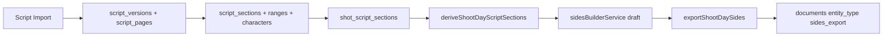

# Script Sections & Sides Builder (SB1–SB9)

Developer notes for the local-first Script Sections & Sides workflow.

## Data flow

1. **Import** ([`script-import-page.tsx`](../src/features/schedule/script-import-page.tsx)) parses `.txt`/`.pdf`, creates schedule scenes, then calls [`generateScriptVersionFromScenes`](../src/lib/db/scriptSectionGenerationService.ts).
2. **Sections** ([`script-sections-page.tsx`](../src/features/schedule/script-sections-page.tsx)) lists/edits `script_sections`; manual sections use `is_manual = 1`.
3. **Shot links** ([`shot-list-page.tsx`](../src/features/schedule/shot-list-page.tsx)) write `shot_script_sections`.
4. **Schedule derive** ([`shootDayScriptSectionsService.ts`](../src/lib/db/shootDayScriptSectionsService.ts)) builds a read-only day summary from stripboard + links.
5. **Sides builder** ([`sidesBuilderService.ts`](../src/lib/db/sidesBuilderService.ts)) filters/selects entries for preview.
6. **Export** ([`sidesExportService.ts`](../src/lib/db/sidesExportService.ts)) renders PDF, stores under `attachments/{productionId}/`, records `shoot_day_sides_exports` + `documents`.

## Best-effort pagination

- Eighths use a fixed **8 eighths per page** model everywhere (parsers, generation, SB5–SB7).
- Generated sections (`is_manual = 0`) carry **estimated** page/eighth ranges from heuristics (TXT line counts, PDF layout). UI surfaces an `est.` badge where relevant.
- Manual sections store user-entered ranges; they are treated as authoritative in the editor.

## Remote-server limitation

SB1 tables (`script_versions`, `script_pages`, `script_sections`, etc.) are **local SQLite only**. For productions whose effective data source is `remote_server`:

- [`generateScriptVersionFromScenes`](../src/lib/db/scriptSectionGenerationService.ts) returns `null` (no SB rows written).
- [`deriveShootDayScriptSections`](../src/lib/db/shootDayScriptSectionsService.ts) returns a neutral empty summary.
- Schedule scene import still works via the existing schedule repository remote path.
- SB UI pages show [`SbRemoteNotice`](../src/features/schedule/sbRemoteNotice.tsx).

## Revision reconciliation

[`scriptSectionReconciliationService.ts`](../src/lib/db/scriptSectionReconciliationService.ts) compares two script versions and classifies sections (matched/changed/removed/added). Safe shot-link remaps are applied explicitly via `applySafeShotLinkRemaps`; manual section links are never auto-remapped. Historical `shoot_day_sides_exports` rows are immutable.

**Soft-delete note:** FK `ON DELETE CASCADE` applies on hard `DELETE` only. Soft-deleting a `script_version` does not cascade to child pages/sections; reads must filter by `deleted_at`.

## Transaction requirements for future SB work

Follow [`DATABASE_LAYER.md`](DATABASE_LAYER.md) §4:

- Multi-row writes: `runInSerializedTransaction` + single `executeBatch` (BEGIN … statements … COMMIT).
- Co-locate outbox rows in the same batch as primary writes.

Key SB write paths:

- [`scriptSectionGenerationService.ts`](../src/lib/db/scriptSectionGenerationService.ts) — import + regeneration
- [`scriptSections.ts`](../src/lib/db/repositories/scriptSections.ts) — section CRUD + shot links
- [`sidesExportService.ts`](../src/lib/db/sidesExportService.ts) — document + export row
- [`duplicateProduction.ts`](../src/lib/db/duplicateProduction.ts) — production copy includes all SB tables

See also [`schedule.md`](schedule.md) for Schedule navigation entry points.
