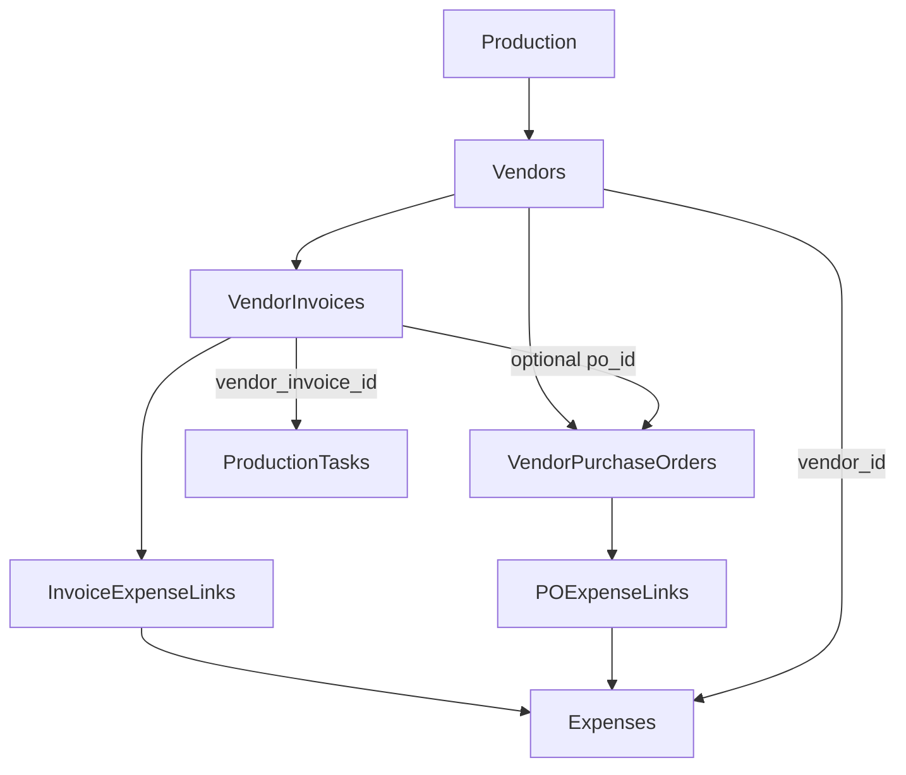

# Vendors

This document is both a **user guide** (how to use Vendor Management) and a **developer guide** (data model, repositories, and implementation). It describes the production-scoped vendor system: vendors, invoices, purchase orders, expense linking, reminder tasks, and dashboard integration.

---

## Table of contents

**Part I — User guide**

- [1. Overview and purpose](#1-overview-and-purpose)
- [2. Key features](#2-key-features)
- [3. Fundamental workflows](#3-fundamental-workflows)
- [4. User-oriented use cases](#4-user-oriented-use-cases)
- [5. Relationships to other parts of the app](#5-relationships-to-other-parts-of-the-app)

**Part II — Developer guide**

- [6. Architecture and file layout](#6-architecture-and-file-layout)
- [7. Data model (summary)](#7-data-model-summary)
- [8. Key flows (for implementors)](#8-key-flows-for-implementors)
- [9. Query keys and invalidation](#9-query-keys-and-invalidation)
- [10. Relationships diagram](#10-relationships-diagram)

**Part III — Reference**

- [11. Router and navigation](#11-router-and-navigation)
- [12. Database migrations (reference list)](#12-database-migrations-reference-list)
- [13. Gaps and future work](#13-gaps-and-future-work)

---

## Part I — User guide

### 1. Overview and purpose

- **Purpose:** Vendor Management is a production-scoped system for tracking vendors, their invoices and purchase orders, linking spend (expenses) to invoices/POs, and surfacing vendor-finance alerts on the Dashboard.
- **Routes:** `/budget/vendors` (vendor list) and `/budget/vendors/:vendorId` (vendor detail). See [src/app/router.tsx](src/app/router.tsx).
- **Navigation:** "Vendors" under Budget in the app nav ([src/app/navigation.ts](src/app/navigation.ts)).
- **Context:** A **current production** must be selected. All vendor data is scoped by `production_id`.

### 2. Key features

| Feature | Description |
|---------|-------------|
| **Vendors** | Create, edit, and archive vendors. Fields: company name (required), primary contact name, primary contact email. **Share across all projects** promotes a vendor to global scope (globe badge); invoices and POs stay per-project. |
| **Vendor invoices** | Add, edit, and archive invoices per vendor. Invoice number, issue/due dates, amount, tax, currency, status (draft → received → approved → paid / overdue). Optional link to a purchase order. Optional file attachment (PDF or image). |
| **Vendor purchase orders** | Add, edit, and archive POs per vendor. PO number, description, issue/due dates, amount, status (draft → issued → approved → closed / cancelled), approval flag. Optional file attachment. |
| **Invoice reminder tasks** | Invoices with a due date get a single linked task in the Tasks system (e.g. "Pay invoice INV-2041 — Arri Rental"). Marking the invoice as paid completes the task; archiving the invoice soft-deletes the task. There is no separate reminder engine. |
| **Expense linking** | From the vendor detail page, link expenses to an invoice and/or to a PO. When logging spend (Purchase, Rental, Deposit), optionally match one invoice and/or one PO in the same save. From an expense detail sheet, retroactively link or upload an invoice and link a PO — even after the expense is matched to a budget line item. One invoice or PO can have many linked expenses. Unlink when needed. |
| **Vendor spend and activity** | Per-vendor total spend (from expenses), a recent activity feed (expenses, invoices, POs), and on the detail page allocation/reconciliation status for linked expenses. |
| **Dashboard** | "Vendor finance" summary cards (overdue invoices, due soon, open POs, POs awaiting approval). **Risk Watch** shows vendor-finance alerts: overdue/due-soon invoices, POs awaiting approval, large unpaid invoices, vendors with unmatched spend, vendors with no recent activity, open PO exposure. Clicks navigate to vendor detail or the vendors list. |

### 3. Fundamental workflows

**Adding a vendor**

1. Go to **Budget → Vendors**.
2. Click **New vendor**.
3. Enter company name (required), optional primary contact and email.
4. Click **Create**. You are taken to that vendor’s detail page.

**Sharing a vendor across projects**

1. Open the vendor’s detail page in the project where it was created.
2. Click **Share across all projects** and confirm.
3. The vendor appears in every project’s vendor list and pickers (globe badge). Company name and contact details are shared; invoices, POs, and spend stay in each project separately.

**Removing a vendor**

1. Open the vendor’s detail page.
2. Click **Remove**.
3. For **shared vendors** (globe badge), choose **This project only** or **All projects**, then click **Confirm** in the second dialog.
   - **This project only** — On the project where the vendor was created, this makes it local again (other projects lose access). On any other project, this hides the vendor in that project only.
   - **All projects** — Removes the vendor from every project’s active lists. Linked spend history is preserved.
4. For project-only vendors, confirm removal in one dialog.

**Managing invoices**

1. Open a vendor’s detail page.
2. In the **Invoices** section, click **Add invoice**.
3. Enter invoice number, optional issue/due dates, amount, tax, currency, status, optional link to a PO, and optionally **upload a file** (PDF or image).
4. If you set a **due date**, a reminder task is created in Tasks. Marking the invoice as **paid** completes that task.
5. Edit or archive invoices from the same section. Use the paperclip on a row to open an attached file.

**Managing purchase orders**

1. On the vendor detail page, open the **Purchase orders** section.
2. Click **Add PO** and enter PO number, description, dates, amount, status, approval, and optionally **upload a file**.
3. Edit or archive POs as needed.

**Logging spend with invoice / PO matching**

1. From **Budget**, click **Log Spend** and choose a Purchase, Rental, or Deposit transaction.
2. Select a **vendor** in the transaction form.
3. Optionally choose a **purchase order** and/or **invoice** (select an existing one or upload a new invoice with optional file). All steps are optional — cross-check amounts yourself; the app does not validate invoice totals against expense amounts.
4. Save. New uploaded invoices appear in the vendor’s **Invoices** section.

**Retroactive invoice / PO linking**

1. Open an expense from the Budget tab (expense detail sheet).
2. When the expense has a vendor, use the **Vendor finance** section to link an existing invoice or PO, or upload a new invoice.
3. This works independently of **Match Spend** / budget line-item reconciliation.

**Linking spend (vendor detail)**

1. On the vendor detail page, open an invoice or a PO.
2. Use **Link expense** to attach one or more expenses (logged spend) to that invoice or PO.
3. Unlink via the same UI when needed. Linked expenses are visible per invoice/PO and contribute to allocation/reconciliation views.

**Finding vendors**

1. Go to **Budget → Vendors**.
2. Use the search box to filter by company name.
3. Select a vendor in the list to see the preview; click **View vendor detail** or the row to open the full detail page.

### 4. User-oriented use cases

**Equipment rental house**

Create a vendor (e.g. "Panavision"), add POs for rental agreements, then add invoices that reference those POs. As you log expenses (e.g. from the Budget page), link them to the correct invoice from the vendor detail page. Use **Risk Watch** on the Dashboard to spot overdue or large unpaid invoices and open the vendor to resolve them.

**Camera and lighting supplier**

Track invoices with due dates (e.g. "Arri Rental"). Each invoice with a due date gets a single reminder task in **Tasks** ("Pay invoice INV-2041 — Arri Rental"). Pay the invoice in the real world, then mark the invoice as **paid** in the app; the linked task is marked complete. No need to manage reminders separately.

**Reconciling spend to invoices**

From the vendor detail page, see which expenses are linked to each invoice or PO. Use **Link expense** to attach logged spend to the right invoice. The page shows allocation status (e.g. from Actualisation) so you can see unmatched spend and reconcile it to budget line items from the Budget tab.

**Dashboard at a glance**

Open the **Dashboard**. The Vendor finance cards show counts (overdue, due soon, open POs, POs awaiting approval). **Risk Watch** lists specific vendor-finance alerts (overdue invoice, large unpaid, unmatched spend, etc.). Click an alert to go to that vendor’s detail page and address the item.

### 5. Relationships to other parts of the app

| Area | Relationship |
|------|----------------|
| **Budget** | Expenses can have a vendor (`vendor_id`) chosen via **VendorPicker** in Log Spend and in typed expense editors (Purchase, Rental, Deposit). The vendor detail page lists expenses for that vendor and shows allocation/reconciliation status. Vendors are a parallel dimension to the chart of accounts; the budget data model is unchanged. |
| **Tasks** | Invoice reminders are normal production tasks with `vendor_invoice_id` set. They appear in the Tasks list and on the Dashboard. Creating/updating/archiving an invoice with a due date is handled by the vendor invoice reminder service; task completion and archiving follow the invoice lifecycle. See [src/lib/db/vendorInvoiceReminderService.ts](src/lib/db/vendorInvoiceReminderService.ts). |
| **Dashboard** | Vendor finance summary (counts and totals) and Risk Watch (vendor-finance alerts) both link to `/budget/vendors` or `/budget/vendors/:vendorId`. |

---

## Part II — Developer guide

### 6. Architecture and file layout

**Data model (types)** — [src/lib/db/types.ts](src/lib/db/types.ts)

- `Vendor`, `VendorInvoice`, `VendorPurchaseOrder`, `VendorInvoiceExpenseLink`, `VendorPurchaseOrderExpenseLink`
- `Expense.vendor_id`, `Expense.vendor` (legacy string)
- `ProductionTask.vendor_invoice_id` (optional; at most one reminder task per invoice)

**Repositories**

- [src/lib/db/repositories/vendors.ts](src/lib/db/repositories/vendors.ts) — list, get, getVendorById (including archived), create, update, soft-delete, promoteVendorToGlobal, demoteVendorToLocal, excludeVendorFromProduction, removeVendorFromProject.
- [src/lib/db/repositories/vendorInvoices.ts](src/lib/db/repositories/vendorInvoices.ts) — CRUD, list by production or by vendor.
- [src/lib/db/repositories/vendorPurchaseOrders.ts](src/lib/db/repositories/vendorPurchaseOrders.ts) — CRUD, list by production or by vendor.
- [src/lib/db/repositories/vendorFinanceLinks.ts](src/lib/db/repositories/vendorFinanceLinks.ts) — invoice↔expense and PO↔expense link tables (list, create, delete; no outbox).
- [src/lib/db/repositories/vendorActivity.ts](src/lib/db/repositories/vendorActivity.ts) — combined recent activity (expenses, invoices, POs) per vendor.

**Orchestration**

- [src/lib/db/vendorInvoiceReminderService.ts](src/lib/db/vendorInvoiceReminderService.ts) — `createInvoiceWithReminderTask`, `updateInvoiceWithReminderTask`, `archiveInvoiceWithReminderTask`. Keeps invoice and linked task in sync in one transaction (create/complete/reopen/soft-delete task).
- [src/lib/db/vendorFinanceDocumentService.ts](src/lib/db/vendorFinanceDocumentService.ts) — `createVendorInvoiceWithDocument`, `createVendorPurchaseOrderWithDocument`, `attachDocumentToVendorInvoice`, `attachDocumentToVendorPurchaseOrder`, `linkExpenseVendorFinance`. Attachments use the `documents` table with `entity_type` `vendor_invoice` or `vendor_purchase_order`.

**Dashboard / Risk Watch**

- [src/lib/dashboard/vendorFinance.ts](src/lib/dashboard/vendorFinance.ts) — Read-only helpers: `getOverdueVendorInvoices`, `getVendorInvoicesDueSoon`, `getOpenVendorPurchaseOrders`, `getVendorPurchaseOrdersAwaitingApproval`, `getDashboardVendorFinanceData`, `dashboardVendorFinanceQueryKey`.
- [src/lib/budget/vendors/riskWatch.ts](src/lib/budget/vendors/riskWatch.ts) — `getVendorFinanceRiskItems(productionId)` (overdue, due soon, PO approval, large unpaid, unmatched spend, inactivity, open PO exposure), `riskWatchQueryKey`.

**UI**

- [src/features/budget/vendors/VendorsIndexPage.tsx](src/features/budget/vendors/VendorsIndexPage.tsx) — Vendor list, search, preview, New vendor.
- [src/features/budget/vendors/VendorDetailPage.tsx](src/features/budget/vendors/VendorDetailPage.tsx) — Vendor edit/archive, share across projects, invoices, POs, expense linking, recent activity, spend/reconciliation.
- [src/features/budget/vendors/GlobalVendorBadge.tsx](src/features/budget/vendors/GlobalVendorBadge.tsx) — Globe icon for global vendors.
- [src/components/vendors/VendorPicker.tsx](src/components/vendors/VendorPicker.tsx) — Vendor dropdown (used in Budget Log Spend and typed expense editors).
- [src/features/budget/vendors/InvoiceStatusBadge.tsx](src/features/budget/vendors/InvoiceStatusBadge.tsx), [PurchaseOrderStatusBadge.tsx](src/features/budget/vendors/PurchaseOrderStatusBadge.tsx) — Status badges for invoice and PO tables.

### 7. Data model (summary)

| Entity | Key fields |
|--------|------------|
| **Vendor** | `id`, `production_id` (origin project), `is_global`, `company_name`, `primary_contact_full_name`, `primary_contact_email`, soft-delete. When `is_global` is true, identity is listed in every production; finance rows remain production-scoped. |
| **VendorInvoice** | `vendor_id`, `po_id` (optional), `invoice_number`, `issue_date`, `due_date`, `amount`, `tax`, `currency_code`, `status` (draft/received/approved/paid/overdue), soft-delete. |
| **VendorPurchaseOrder** | `vendor_id`, `po_number`, `description`, `issue_date`, `due_date`, `amount`, `status`, `approval`, soft-delete. |
| **Link tables** | Invoice↔expense and PO↔expense: many-to-one (many expenses per invoice/PO). No outbox. |
| **Expense** | `vendor_id` (optional FK to vendors), `vendor` (legacy string). |
| **ProductionTask** | `vendor_invoice_id` (optional; at most one task per invoice for reminders). |

### 8. Key flows (for implementors)

**Invoice + task lifecycle**

- Use `createInvoiceWithReminderTask`, `updateInvoiceWithReminderTask`, and `archiveInvoiceWithReminderTask` from the UI. Do not create or update reminder tasks manually; the service keeps the task in sync with the invoice (due date, paid status, archive).

**Risk Watch data**

- `getVendorFinanceRiskItems(productionId)` loads invoices, POs, vendors, expenses, and budget-item–expense links (reconciliation). It builds items for overdue/due-soon invoices, POs awaiting approval, large unpaid invoices, vendors with unmatched spend, vendors with no recent activity, and open PO exposure. Results are sorted by severity and date and capped (e.g. 20 items).

**Query invalidation**

- When invoices, POs, expense links, or vendor data change, invalidate `dashboardVendorFinanceQueryKey(productionId)` and `riskWatchQueryKey(productionId)` in addition to the relevant vendor/invoice/PO list keys. When a **global** vendor is edited, archived, or promoted, invalidate `['vendors']` (all productions). Risk Watch must also be invalidated when **reconciliation** (budget-item–expense links) or **expenses** change (e.g. from the actualisation page or Log Spend), not only when invoices/POs change. See VendorDetailPage, budget page, LogSpendPanel, and actualisation page for examples.

**APF export**

- [`resolveVendorsForExport`](src/lib/importExport/resolveVendorsForExport.ts) exports production-owned vendors plus **portable copies** of global vendors referenced in that production (expenses, invoices, POs, equipment). Copies use the exported `production_id` and `is_global = 0` so `.apf` packages are self-contained on import.

### 9. Query keys and invalidation

| Key | Usage |
|-----|--------|
| `['vendors', productionId]` | Vendor list for the production (includes global vendors). |
| `['vendors']` | Invalidate all production vendor lists (e.g. after promoting or editing a global vendor). |
| `vendorInvoicesQueryKey` / list keys | Invoice lists (by production or vendor). |
| `vendorPurchaseOrdersQueryKey` / list keys | PO lists (by production or vendor). |
| `vendorInvoiceExpenseLinksQueryKey(invoiceId)` | Links for one invoice. |
| `vendorPurchaseOrderExpenseLinksQueryKey(poId)` | Links for one PO. |
| `vendorRecentActivityQueryKey(productionId, vendorId)` | Recent activity feed for one vendor. |
| `dashboardVendorFinanceQueryKey(productionId)` | Dashboard vendor finance summary. |
| `riskWatchQueryKey(productionId)` | Risk Watch items. Invalidate when invoices, POs, vendors, expenses, or **budget-item–expense links** change. |

### 10. Relationships diagram

---

## Part III — Reference

### 11. Router and navigation

| Route | Component | Description |
|-------|-----------|-------------|
| `budget/vendors` | `VendorsIndexPage` | Vendor list, search, preview, New vendor. |
| `budget/vendors/:vendorId` | `VendorDetailPage` | Vendor edit/archive, invoices, POs, expense linking, activity, spend. |

The Dashboard links "Vendor finance" and Risk Watch items to `/budget/vendors` or `/budget/vendors/:vendorId`.

### 12. Database migrations (reference list)

| Migration | Scope |
|-----------|--------|
| `0020_vendors_and_expense_transaction_details.sql` | Vendors table and expense transaction details. |
| `0034_vendor_invoices.sql` | Vendor invoices table. |
| `0035_production_tasks_vendor_invoice_id.sql` | Task–invoice link for reminders. |
| `0036_vendor_purchase_orders.sql` | Vendor purchase orders table. |
| `0037_vendor_invoices_po_id.sql` | Invoice optional link to PO. |
| `0038_vendor_invoice_expenses.sql` | Invoice–expense link table. |
| `0039_vendor_purchase_order_expenses.sql` | PO–expense link table. |
| `0081_vendors_is_global.sql` (SQLite) / `0015_vendors_is_global.sql` (Postgres) | `vendors.is_global` for cross-project vendor identity. |

### 13. Gaps and future work

- **Demote global vendor:** Use **Remove → This project only** on the origin project (`demoteVendorToLocal`).
- **Hide global vendor from one project:** Use **Remove → This project only** on a non-origin project (`vendor_production_exclusions`).
- **Create as global:** New vendors are project-scoped until promoted from the detail page.

- **Risk Watch drilldown:** Alerts link to vendor detail only; there is no invoice-level or PO-level drilldown from Risk Watch.
- **PO reminder tasks:** Only invoices get reminder tasks; POs do not create tasks.
- **Currency:** Risk Watch thresholds (e.g. large unpaid, open PO exposure) use stored amounts; there is no cross-currency normalization.
- **Optional extensions:** Invoice/PO-level deep links, PO reminder tasks, or currency-aware thresholds could be added later.
