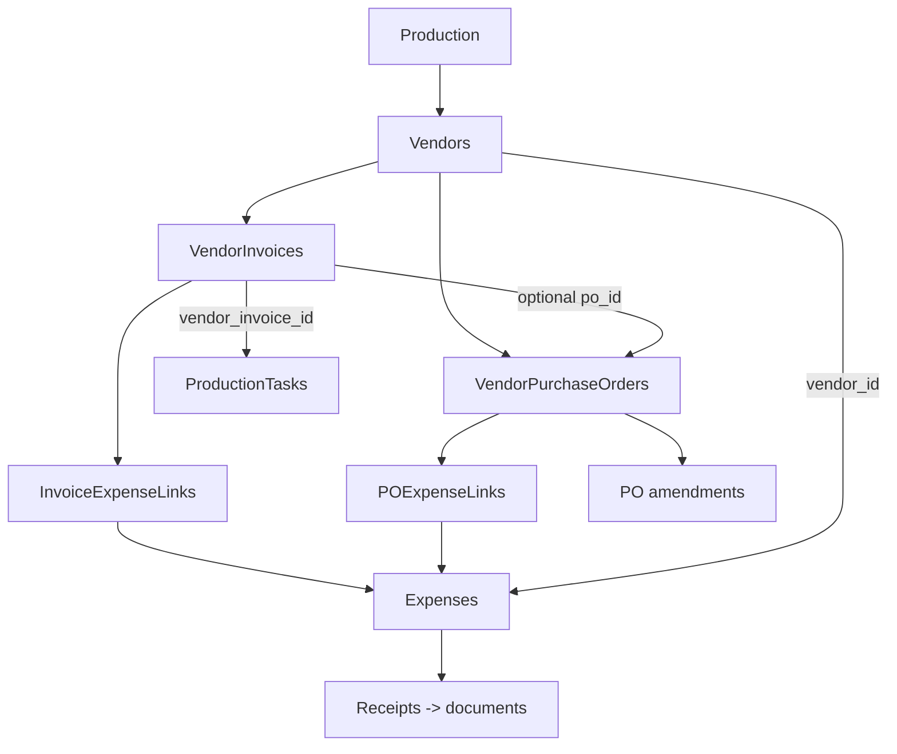

# Vendors

This document is both a **user guide** (how to use Vendor Management) and a **developer guide** (data model, repositories, and implementation). It describes the production-scoped vendor system: vendors, invoices, purchase orders (with allocations and amendments), receipts and proof of spend, expense linking, reminder tasks, and dashboard integration.

---

## Table of contents

**Part I — User guide**

- [1. Overview and purpose](#1-overview-and-purpose)
- [2. Key features](#2-key-features)
- [3. Fundamental workflows](#3-fundamental-workflows)
- [4. User-oriented use cases](#4-user-oriented-use-cases)
- [5. Relationships to other parts of the app](#5-relationships-to-other-parts-of-the-app)

**Part II — Developer guide**

- [6. Architecture and file layout](#6-architecture-and-file-layout)
- [7. Data model (summary)](#7-data-model-summary)
- [8. Key flows (for implementors)](#8-key-flows-for-implementors)
- [9. Query keys and invalidation](#9-query-keys-and-invalidation)
- [10. Relationships diagram](#10-relationships-diagram)

**Part III — Reference**

- [11. Router and navigation](#11-router-and-navigation)
- [12. Database migrations (reference list)](#12-database-migrations-reference-list)
- [13. Gaps and future work](#13-gaps-and-future-work)

---

## Part I — User guide

### 1. Overview and purpose

- **Purpose:** Vendor Management is a production-scoped system for tracking vendors, their invoices and purchase orders, linking spend (expenses) to invoices/POs, and surfacing vendor-finance alerts on the Dashboard.
- **Routes:** `/budget/vendors` (vendor list) and `/budget/vendors/:vendorId` (vendor detail). See [src/app/router.tsx](src/app/router.tsx).
- **Navigation:** "Vendors" under Budget in the app nav ([src/app/navigation.ts](src/app/navigation.ts)).
- **Context:** A **current production** must be selected. All vendor data is scoped by `production_id`.

### 2. Key features

| Feature | Description |
|---------|-------------|
| **Vendors** | Create, edit, and archive vendors. Fields: company name (required), primary contact name, primary contact email. **Share across all projects** promotes a vendor to global scope (globe badge); invoices and POs stay per-project. |
| **Vendor invoices** | Add, edit, and archive invoices per vendor. Invoice number, issue/due dates, amount, tax, currency, status (draft → received → approved → paid / overdue). Optional link to a purchase order. Optional file attachment (PDF or image). |
| **Vendor purchase orders** | Add, edit, and archive POs per vendor. PO number, description, issue/due dates, **amount (excl. tax)**, **currency + locked exchange rate**, and status (draft → issued → approved → closed / cancelled; choosing *approved* or *closed* is what makes a PO approved - there is no separate approval tickbox). Optional file attachment. POs in a foreign currency show the amount converted to the production currency with the original in brackets, e.g. `£790.00 ($1,000.00)`. The PO table shows **Committed** (spend matched to the PO) and **Remaining** (amount − committed; red when over-committed). |
| **PO amendments** | A PO's value can be raised or lowered at any time. The amount on the PO is always the *current* value; every change is recorded in an audit trail (previous → new value, reason, date). A history icon next to an amended PO's amount lists the trail, e.g. "Increased £2,000 → £5,000 · client uplift". Amend from **Edit PO** (a "Reason for the change" field appears when you change the amount) or with **Increase PO to cover** in Log Spend / expense edit. |
| **Receipts** | A receipt is a file (PDF or image) attached directly to an expense, with optional date, amount and reference. Receipts need **no vendor**, so they work for petty cash, and apply to every transaction type. An expense can have several receipts. |
| **Proof of spend** | An expense *has proof* when it has at least one receipt, or is linked to a vendor invoice that has a file attached (an invoice record with no file is not proof). Expenses without proof show a **No proof** badge. |
| **Invoice reminder tasks** | Invoices with a due date get a single linked task in the Tasks system (e.g. "Pay invoice INV-2041 — Arri Rental"). Marking the invoice as paid completes the task; archiving the invoice soft-deletes the task. There is no separate reminder engine. |
| **Expense linking ("PO & documents")** | One section, shared by **Log Spend** and the **expense detail sheet**, matches an expense to **one or more POs** (with an amount per PO when there are several) and attaches proof: a receipt, an existing invoice, or a newly uploaded invoice. From the vendor detail page you can also link expenses to an invoice or PO. One invoice or PO can have many linked expenses, and one expense can sit on several POs. Unlink when needed; unlinking only removes the link and never edits the invoice or PO. |
| **Vendor spend and activity** | Per-vendor total spend (from expenses), a recent activity feed (expenses, invoices, POs), and on the detail page allocation/reconciliation status for linked expenses. |
| **Dashboard** | "Vendor finance" summary cards (overdue invoices, due soon, open POs, POs awaiting approval). **Risk Watch** shows vendor-finance alerts: overdue/due-soon invoices, POs awaiting approval, large unpaid invoices, vendors with unmatched spend (budget-line matching), vendors with no recent activity, open PO exposure, **POs over-committed** (matched spend above the PO value; critical when more than 10% over), **vendor spend with no PO matched** (only for vendors that have POs) and **spend with no proof** (including petty cash). Clicks navigate to vendor detail or the vendors list. |
| **Badges** | **No PO** (vendor spend not matched to any PO; never shown for petty cash / vendorless spend) and **No proof** appear on expense rows (Budget → Examine Account, the Uncoded spend list, Match Spend) and in the expense detail header. They are hints, not errors. |

### 3. Fundamental workflows

**Adding a vendor**

1. Go to **Budget → Vendors**.
2. Click **New vendor**.
3. Enter company name (required), optional primary contact and email.
4. Click **Create**. You are taken to that vendor’s detail page.

**Sharing a vendor across projects**

1. Open the vendor’s detail page in the project where it was created.
2. Click **Share across all projects** and confirm.
3. The vendor appears in every project’s vendor list and pickers (globe badge). Company name and contact details are shared; invoices, POs, and spend stay in each project separately.

**Removing a vendor**

1. Open the vendor’s detail page.
2. Click **Remove**.
3. For **shared vendors** (globe badge), choose **This project only** or **All projects**, then click **Confirm** in the second dialog.
   - **This project only** — On the project where the vendor was created, this makes it local again (other projects lose access). On any other project, this hides the vendor in that project only.
   - **All projects** — Removes the vendor from every project’s active lists. Linked spend history is preserved.
4. For project-only vendors, confirm removal in one dialog.

**Managing invoices**

1. Open a vendor’s detail page.
2. In the **Invoices** section, click **Add invoice**.
3. Enter invoice number, optional issue/due dates, amount, tax, currency, status, optional link to a PO, and optionally **upload a file** (PDF or image).
4. If you set a **due date**, a reminder task is created in Tasks. Marking the invoice as **paid** completes that task.
5. Edit or archive invoices from the same section. Use the paperclip on a row to open an attached file.

**Managing purchase orders**

1. On the vendor detail page, open the **Purchase orders** section.
2. Click **Add PO** and enter PO number, description, dates, amount (excl. tax), currency (defaults to the production currency; for another currency the exchange rate is prefilled from the live rate, or entered by hand when offline - it is locked on the PO), status, and optionally **upload a file**.
3. Edit or archive POs as needed.

**Logging spend with POs and proof (Log Spend)**

1. From **Budget**, click **Log Spend**, choose an account and a transaction type.
2. The **PO & documents** section sits directly under the account / type (before the details form):
   - **Purchase orders** — search by PO number, description or vendor name and tick one or more. Rows show vendor, status, amount and what is left. By default only issued and approved POs are listed; tick *Include draft, closed and cancelled* to see the rest. Picking a PO fills the vendor if it is empty; once a vendor is set the list is scoped to it (tick *Search all vendors* to widen it). If the vendor has exactly one open PO a one-tap **Use PO-…** chip is offered.
   - **Match summary** — for each PO: this spend, PO amount and what is left after this spend, live as you type the amount. With **several POs** enter how much of the spend goes to each.
   - **Proof** — **Receipt** (file plus optional date, amount, reference; no vendor needed), **Invoice** (pick an existing invoice, or upload a new one with a number and optional file), or **None**.
3. **Warnings never block saving.** The section warns when the spend exceeds a PO's remaining balance, when allocations do not add up to the spend, when the invoice amount differs from the spend, or when the invoice already sits on a different PO. When a PO would go over, **Increase PO to cover** raises its value (and records an amendment) without leaving the dialog.
4. Save. The expense, PO links, invoice / receipt and files are saved in **one transaction**: either everything is saved or nothing is, and a retry can never create a duplicate expense. PO warnings are shown in a toast after saving.

PO and invoice matching needs a vendor and applies to Purchase, Rental and Deposit spend. Receipts work for every type and with no vendor.

**Changing POs and proof on an existing expense**

1. Open an expense from the Budget tab (expense detail sheet). The same **PO & documents** section is shown under the details.
2. Add or remove POs, change per-PO amounts, link or unlink invoices, upload a new invoice, add a receipt, replace a receipt's file or remove a receipt. Nothing is written until you press **Save PO & documents** (or **Discard**); everything is applied in one transaction.
3. The vendor on the expense is fixed here (change it in the details editor); the PO list is limited to that vendor.
4. This works independently of **Match Spend** / budget line-item reconciliation.

**Increasing (amending) a PO**

1. From **Log Spend** or an expense: click **Increase PO to cover** on the over-balance warning, confirm the suggested new amount and add an optional reason.
2. Or on the vendor detail page: **Edit PO**, change **Amount**, optionally add a **Reason for the change**, **Save**.
3. The PO's current amount changes and an amendment row (previous → new, reason) is added in the same transaction. Committed / remaining figures, Risk Watch and dashboards refresh.

**Receipts, petty cash and floats**

1. Log petty-cash spend with **Proof → Receipt** and no vendor; or add a receipt later from the expense detail sheet.
2. In **Budget → Floats**, the reconciliation overview and dialog show each matched expense's proof status (**Receipt**, **Invoice on file**, **Missing receipt**) and a non-blocking warning such as "3 of 12 expenses missing receipts". You can still reconcile; use **Attach receipt** on a matched expense to fix it on the spot.

**Linking spend (vendor detail)**

1. On the vendor detail page, open an invoice or a PO.
2. Use **Link expense** to attach one or more expenses (logged spend) to that invoice or PO.
3. Unlink via the same UI when needed. Linked expenses are visible per invoice/PO and contribute to allocation/reconciliation views.

**Finding vendors**

1. Go to **Budget → Vendors**.
2. Use the search box to filter by company name.
3. Select a vendor in the list to see the preview; click **View vendor detail** or the row to open the full detail page.

### 4. User-oriented use cases

**Equipment rental house**

Create a vendor (e.g. "Panavision"), add POs for rental agreements, then add invoices that reference those POs. As you log expenses (e.g. from the Budget page), link them to the correct invoice from the vendor detail page. Use **Risk Watch** on the Dashboard to spot overdue or large unpaid invoices and open the vendor to resolve them.

**Camera and lighting supplier**

Track invoices with due dates (e.g. "Arri Rental"). Each invoice with a due date gets a single reminder task in **Tasks** ("Pay invoice INV-2041 — Arri Rental"). Pay the invoice in the real world, then mark the invoice as **paid** in the app; the linked task is marked complete. No need to manage reminders separately.

**Reconciling spend to invoices**

From the vendor detail page, see which expenses are linked to each invoice or PO. Use **Link expense** to attach logged spend to the right invoice. The page shows allocation status (e.g. from Actualisation) so you can see unmatched spend and reconcile it to budget line items from the Budget tab.

**Dashboard at a glance**

Open the **Dashboard**. The Vendor finance cards show counts (overdue, due soon, open POs, POs awaiting approval). **Risk Watch** lists specific vendor-finance alerts (overdue invoice, large unpaid, unmatched spend, etc.). Click an alert to go to that vendor’s detail page and address the item.

### 5. Relationships to other parts of the app

| Area | Relationship |
|------|----------------|
| **Budget** | Expenses can have a vendor (`vendor_id`) chosen via **VendorPicker** in Log Spend and in typed expense editors (Purchase, Rental, Deposit). The vendor detail page lists expenses for that vendor and shows allocation/reconciliation status. Vendors are a parallel dimension to the chart of accounts; the budget data model is unchanged. |
| **Tasks** | Invoice reminders are normal production tasks with `vendor_invoice_id` set. They appear in the Tasks list and on the Dashboard. Creating/updating/archiving an invoice with a due date is handled by the vendor invoice reminder service; task completion and archiving follow the invoice lifecycle. See [src/lib/db/vendorInvoiceReminderService.ts](src/lib/db/vendorInvoiceReminderService.ts). |
| **Dashboard** | Vendor finance summary (counts and totals) and Risk Watch (vendor-finance alerts) both link to `/budget/vendors` or `/budget/vendors/:vendorId`. |

---

## Part II — Developer guide

### 6. Architecture and file layout

**Data model (types)** — [src/lib/db/types.ts](src/lib/db/types.ts)

- `Vendor`, `VendorInvoice`, `VendorPurchaseOrder`, `VendorInvoiceExpenseLink`, `VendorPurchaseOrderExpenseLink` (with `allocated_amount`), `VendorPurchaseOrderAmendment`, `ExpenseReceiptRow`
- `Expense.vendor_id`, `Expense.vendor` (legacy string)
- `ProductionTask.vendor_invoice_id` (optional; at most one reminder task per invoice)

**Repositories**

- [src/lib/db/repositories/vendors.ts](src/lib/db/repositories/vendors.ts) — list, get, getVendorById (including archived), create, update, soft-delete, promoteVendorToGlobal, demoteVendorToLocal, excludeVendorFromProduction, removeVendorFromProject.
- [src/lib/db/repositories/vendorInvoices.ts](src/lib/db/repositories/vendorInvoices.ts) — CRUD, list by production or by vendor.
- [src/lib/db/repositories/vendorPurchaseOrders.ts](src/lib/db/repositories/vendorPurchaseOrders.ts) — CRUD, list by production or by vendor.
- [src/lib/db/repositories/vendorFinanceLinks.ts](src/lib/db/repositories/vendorFinanceLinks.ts) — invoice↔expense and PO↔expense link tables: list, create, delete, statement builders (`buildCreate…Statements`, `buildDelete…Statements`, `buildUpdatePoExpenseLinkAllocationStatements`, all with outbox rows), `listPoCommitmentLinksByPurchaseOrderIds` / `…ByProduction` (input to `computePoCommitments`) and `listPoLinkCountsByExpenseIds` (batched, for badges).
- [src/lib/db/repositories/vendorPurchaseOrderAmendments.ts](src/lib/db/repositories/vendorPurchaseOrderAmendments.ts) — `amendPurchaseOrderAmount({poId, newAmount, reason?, patch?})` (amendment row + PO update, one transaction; `patch` carries other PO fields from the edit dialog), `listAmendmentsByPurchaseOrderIds` (batched, newest first).
- [src/lib/db/repositories/expenseReceipts.ts](src/lib/db/repositories/expenseReceipts.ts) — receipts per expense, `listReceiptStatusByExpenseIds` (batched proof counts), statement builders, `invalidateExpenseReceiptQueries`.
- [src/lib/db/repositories/vendorActivity.ts](src/lib/db/repositories/vendorActivity.ts) — combined recent activity (expenses, invoices, POs) per vendor.

**Orchestration**

- [src/lib/db/vendorInvoiceReminderService.ts](src/lib/db/vendorInvoiceReminderService.ts) — `createInvoiceWithReminderTask`, `updateInvoiceWithReminderTask`, `archiveInvoiceWithReminderTask`. Keeps invoice and linked task in sync in one transaction (create/complete/reopen/soft-delete task).
- [src/lib/db/vendorFinanceDocumentService.ts](src/lib/db/vendorFinanceDocumentService.ts) — `createVendorInvoiceWithDocument`, `createVendorPurchaseOrderWithDocument`, `attachDocumentToVendorInvoice`, `attachDocumentToVendorPurchaseOrder`, **`createExpenseWithFinance`** (expense + details + tax allocations + PO links + invoice / receipt in ONE transaction; stable `expenseId` makes retries idempotent), the shared draft type `ExpenseVendorFinanceDraft` with `emptyExpenseVendorFinanceDraft`, `validateExpenseVendorFinanceDraft`, `hasPendingFinanceChanges`, and `buildInvoiceLinkPart` (shared by create and apply). Attachments use the `documents` table with `entity_type` `vendor_invoice`, `vendor_purchase_order` or `expense_receipt`.
- [src/lib/db/applyFinanceDraftToExpense.ts](src/lib/db/applyFinanceDraftToExpense.ts) — **`applyFinanceDraftToExpense({expenseId, productionCurrency, draft})`**: the edit-side twin of `createExpenseWithFinance`. The draft's `poAllocations` is the full desired PO set (diffed against the stored links: add / remove / re-allocate); `unlinkInvoiceIds` removes invoice links only (the invoice record is never edited); `invoiceMode` links an existing invoice or uploads a new one; `receipt` attaches, `removeReceiptIds` / `replaceReceiptFiles` change existing receipts. One transaction; written files are removed on failure; returns `{changed, warnings, affectedPoIds, affectedInvoiceIds, receiptsChanged}`. Committed / remaining are derived from the link rows, so nothing is recomputed here; callers invalidate queries.
- [src/lib/db/expenseReceiptService.ts](src/lib/db/expenseReceiptService.ts) — `buildExpenseReceiptPlan`, `buildReplaceReceiptFilePlan`, `attachReceiptToExpense`, `updateExpenseReceiptDetails`.

**Dashboard / Risk Watch**

- [src/lib/dashboard/vendorFinance.ts](src/lib/dashboard/vendorFinance.ts) — Read-only helpers: `getOverdueVendorInvoices`, `getVendorInvoicesDueSoon`, `getOpenVendorPurchaseOrders`, `getVendorPurchaseOrdersAwaitingApproval`, `getDashboardVendorFinanceData`, `dashboardVendorFinanceQueryKey`.
- [src/lib/budget/vendors/riskWatch.ts](src/lib/budget/vendors/riskWatch.ts) — `getVendorFinanceRiskItems(productionId)` (overdue, due soon, PO approval, large unpaid, unmatched spend, inactivity, open PO exposure, plus the PO / proof signals below), `riskWatchQueryKey`, `riskWatchBaseQueryKey` (prefix used for invalidation).
- [src/lib/budget/vendors/riskWatchSignals.ts](src/lib/budget/vendors/riskWatchSignals.ts) — pure builders: `overCommittedPoItems`, `noPoSpendItems`, `noProofSpendItems`.

**Pure logic (no DB)**

- [src/lib/budget/vendors/poMatching.ts](src/lib/budget/vendors/poMatching.ts) — committed / remaining per PO (`computePoCommitments`), allocation rules (NULL allocation + exactly one PO = whole expense), `getPoMatchWarnings`, `suggestPoIncrease`.
- [src/lib/budget/vendors/poPicker.ts](src/lib/budget/vendors/poPicker.ts) — PO combobox rows, filtering, one-tap suggestion, match summary rows.
- [src/lib/budget/vendors/poAmendments.ts](src/lib/budget/vendors/poAmendments.ts) — `describeAmendment` ("Increased £2,000 → £5,000 · reason").
- [src/lib/budget/receiptStatus.ts](src/lib/budget/receiptStatus.ts) — the **proof rule** (`expenseHasProof`, `getExpenseProofKind`) and float coverage summaries.
- [src/lib/budget/expenseFinanceFlags.ts](src/lib/budget/expenseFinanceFlags.ts) — **No PO / No proof** flags. No PO applies only to vendor-type spend (`PO_MATCHABLE_TRANSACTION_TYPES`: purchase, rental, deposit) with a vendor.
- [src/lib/budget/vendors/invalidateVendorFinanceQueries.ts](src/lib/budget/vendors/invalidateVendorFinanceQueries.ts) — `invalidatePurchaseOrderQueries` and `invalidateExpenseFinanceQueries`: the one set of keys every writer invalidates.

**UI**

- [src/features/budget/vendors/VendorsIndexPage.tsx](src/features/budget/vendors/VendorsIndexPage.tsx) — Vendor list, search, preview, New vendor.
- [src/features/budget/vendors/VendorDetailPage.tsx](src/features/budget/vendors/VendorDetailPage.tsx) — Vendor edit/archive, share across projects, invoices, POs (Committed / Remaining columns, amendment history popover, amount changes via `amendPurchaseOrderAmount`), expense linking, recent activity, spend/reconciliation.
- [src/features/budget/vendors/ExpenseDocumentMatch.tsx](src/features/budget/vendors/ExpenseDocumentMatch.tsx) — **the one "PO & documents" UI**, fully controlled (`draft` / `onDraftChange`) and used by both Log Spend (`mode="create"`) and the expense detail sheet (`mode="edit"`, via `ExpenseFinanceEditor`). Composes `PurchaseOrderCombobox`, `PoMatchSummary`, `IncreasePoDialog` and, in edit mode, `ExistingProofList` (staged unlink / remove / replace).
- [src/features/budget/vendors/ExpenseFinanceEditor.tsx](src/features/budget/vendors/ExpenseFinanceEditor.tsx) — edit-side host: loads stored links / invoices / receipts, holds the draft, validates, calls `applyFinanceDraftToExpense`, invalidates, shows warnings.
- [src/features/budget/ExpenseFinanceBadges.tsx](src/features/budget/ExpenseFinanceBadges.tsx) + [useExpenseFinanceFlags.ts](src/features/budget/useExpenseFinanceFlags.ts) — No PO / No proof badges; one batched lookup per list.
- [src/features/budget/vendors/GlobalVendorBadge.tsx](src/features/budget/vendors/GlobalVendorBadge.tsx) — Globe icon for global vendors.
- [src/components/vendors/VendorPicker.tsx](src/components/vendors/VendorPicker.tsx) — Vendor dropdown (used in Budget Log Spend and typed expense editors).
- [src/features/budget/vendors/InvoiceStatusBadge.tsx](src/features/budget/vendors/InvoiceStatusBadge.tsx), [PurchaseOrderStatusBadge.tsx](src/features/budget/vendors/PurchaseOrderStatusBadge.tsx) — Status badges for invoice and PO tables.

### 7. Data model (summary)

| Entity | Key fields |
|--------|------------|
| **Vendor** | `id`, `production_id` (origin project), `is_global`, `company_name`, `primary_contact_full_name`, `primary_contact_email`, soft-delete. When `is_global` is true, identity is listed in every production; finance rows remain production-scoped. |
| **VendorInvoice** | `vendor_id`, `po_id` (optional), `invoice_number`, `issue_date`, `due_date`, `amount`, `tax`, `currency_code`, `status` (draft/received/approved/paid/overdue), soft-delete. |
| **VendorPurchaseOrder** | `vendor_id`, `po_number`, `description`, `issue_date`, `due_date`, `amount` (the CURRENT value, in the PO's own currency, excl. tax), `currency_code` (NULL = production currency), `exchange_rate` (1 unit of PO currency in production currency, locked on the PO; NULL with a NULL currency), `status`, `approval` (**derived** from status: approved / closed => 1, never user-set; kept for sync / export compatibility), soft-delete. |
| **VendorPurchaseOrderAmendment** | `vendor_purchase_order_id`, `previous_amount`, `new_amount`, `reason`, timestamps, soft-delete. Written with every `amendPurchaseOrderAmount`; never edited. |
| **Link tables** | Invoice↔expense and PO↔expense: many-to-many (an expense can have several POs; a PO / invoice many expenses). `vendor_purchase_order_expenses.allocated_amount` is the amount charged to the PO (NULL = whole expense, valid only while the expense has a single PO). Link writes record outbox rows. |
| **ExpenseReceipt** | `expense_id`, `document_id` (UNIQUE; the file is a `documents` row with `entity_type = 'expense_receipt'`), optional `receipt_date`, `amount`, `reference`. |
| **Expense** | `vendor_id` (optional FK to vendors), `vendor` (legacy string). |
| **ProductionTask** | `vendor_invoice_id` (optional; at most one task per invoice for reminders). |

### 8. Key flows (for implementors)

**Invoice + task lifecycle**

- Use `createInvoiceWithReminderTask`, `updateInvoiceWithReminderTask`, and `archiveInvoiceWithReminderTask` from the UI. Do not create or update reminder tasks manually; the service keeps the task in sync with the invoice (due date, paid status, archive).

**Warn, don't block**

- Mismatch checks (spend above a PO's remaining balance, allocations not adding up to the spend, invoice amount different from the spend, invoice already on another PO) are **warnings** returned by `getPoMatchWarnings` and surfaced in the UI / a toast. They never stop a save. Hard errors are limited to data that cannot be stored: a PO or invoice of a different vendor or production, matching with no vendor, several POs without an allocation each, an invalid amount, an invoice upload with no number, a receipt detail with no file. Policy / enforcement ("spend over X needs a PO") is deliberately out of scope and handled by the separate rules planning.

**Creating and editing an expense's POs and proof**

- Create: `createExpenseWithFinance` (Log Spend). Edit: `applyFinanceDraftToExpense` (expense detail sheet). Both build statements with the same builders and run them in one `runInSerializedTransaction` + `executeBatch`. `invoice.po_id` is only filled when empty, never overwritten. Unlinking removes the link row only (nothing on the invoice / PO is cleared); committed and remaining figures are derived from the link rows, so they update as soon as the queries are invalidated.

**PO amendments**

- Change a PO's value only through `amendPurchaseOrderAmount` (the Edit PO dialog and `IncreasePoDialog` both do). Plain `updateVendorPurchaseOrder({amount})` skips the audit trail.

**Risk Watch data**

- `getVendorFinanceRiskItems(productionId)` loads invoices, POs, vendors, expenses, budget-item–expense links (reconciliation), PO commitment links and batched proof counts. It builds items for overdue/due-soon invoices, POs awaiting approval, large unpaid invoices, vendors with unmatched spend, vendors with no recent activity, open PO exposure, **POs over-committed** (committed > amount, cancelled excluded; critical above 10% over), **vendor spend with no PO** (one item per vendor; only vendors with at least one non-cancelled PO; only vendor-type spend) and **spend with no proof** (one item per vendor plus one for vendorless spend). Results are sorted by severity and date and capped (20 items).

**Sync and publish status**

- *Outbox (local change journal):* every write to `vendor_purchase_orders`, `vendor_purchase_order_amendments`, `vendor_invoices`, `vendor_invoice_expenses`, `vendor_purchase_order_expenses` (create / allocation update / delete), `expense_receipts` and their `documents` rows writes an `outbox` row in the same transaction.
- *sync-v2 registry (`src/lib/server/syncV2/registry.ts`):* **none of these tables is registered.** The registry is the `pilot-v1` ring (productions, scenes, shots) and the collaboration plan gates vendors behind client-side encryption of sensitive fields ("do not add people, locations, vendors, clients ... until project-key envelope encryption and recovery are implemented"). Registering the link tables would also require registering `expenses` (and its accounts / revisions graph), `vendors`, `vendor_purchase_orders`, `vendor_invoices` and `documents` first, because `registry.integration.test.ts` requires every non-deferred foreign key to point at a registered table (link FKs are NOT NULL, so they cannot be deferred). That is a whole budget / vendor ring, not a PO change. When that ring is added, the new tables classify as: `vendor_purchase_order_expenses`, `vendor_invoice_expenses` — collaborative, ownership via parent PO / invoice, hard-deleted (the delete outbox rows already exist); `vendor_purchase_order_amendments` — collaborative, append-only; `expense_receipts` — asset-backed through its `documents` row (file bytes go through the later asset protocol). Nothing else needs to change in the data layer.
- *Publish / APF (`.apf` import-export):* the link tables (with `allocated_amount`), `vendor_purchase_order_amendments` and `expense_receipts` (plus receipt document bytes) are in `PUBLISH_TABLE_ORDER` and the APF format (v6). See [project-import-export-format-v1.md](project-import-export-format-v1.md). `duplicateProduction` does not copy these tables (it never copied the link tables).

**Query invalidation**

- When invoices, POs, expense links, or vendor data change, invalidate `dashboardVendorFinanceQueryKey(productionId)` and `riskWatchQueryKey(productionId)` in addition to the relevant vendor/invoice/PO list keys. When a **global** vendor is edited, archived, or promoted, invalidate `['vendors']` (all productions). Risk Watch must also be invalidated when **reconciliation** (budget-item–expense links) or **expenses** change (e.g. from the actualisation page or Log Spend), not only when invoices/POs change. See VendorDetailPage, budget page, LogSpendPanel, and actualisation page for examples.

**APF export**

- [`resolveVendorsForExport`](src/lib/importExport/resolveVendorsForExport.ts) exports production-owned vendors plus **portable copies** of global vendors referenced in that production (expenses, invoices, POs, equipment). Copies use the exported `production_id` and `is_global = 0` so `.apf` packages are self-contained on import.

### 9. Query keys and invalidation

| Key | Usage |
|-----|--------|
| `['vendors', productionId]` | Vendor list for the production (includes global vendors). |
| `['vendors']` | Invalidate all production vendor lists (e.g. after promoting or editing a global vendor). |
| `vendorInvoicesQueryKey` / list keys | Invoice lists (by production or vendor). |
| `vendorPurchaseOrdersQueryKey` / list keys | PO lists (by production or vendor). |
| `vendorInvoiceExpenseLinksQueryKey(invoiceId)` | Links for one invoice. |
| `vendorPurchaseOrderExpenseLinksQueryKey(poId)` | Links for one PO. |
| `vendorInvoiceLinksByExpenseQueryKey(expenseId)` / `vendorPurchaseOrderLinksByExpenseQueryKey(expenseId)` | Links for one expense (edit sheet baseline). |
| `vendorPurchaseOrdersByProductionQueryKey(productionId)` | All POs of the production (PO combobox). |
| `vendorPoCommitmentLinksQueryKey(productionId)` | PO↔expense rows with amounts for `computePoCommitments`. Also the prefix of the vendor page's `[…, vendorId, poIds]` key. |
| `vendorPoAmendmentsByVendorQueryKey(productionId, vendorId)` | Batched amendment trails for a vendor's POs (vendor page history popover). |
| `expenseReceiptsQueryKey(expenseId)` / `expenseReceiptStatusBaseQueryKey(productionId)` | Receipts of one expense / batched proof status (badges, floats, Risk Watch). |
| `expensePoLinkCountsBaseQueryKey(productionId)` | Batched PO link counts (No PO badge). |
| `vendorRecentActivityQueryKey(productionId, vendorId)` | Recent activity feed for one vendor. |
| `dashboardVendorFinanceQueryKey(productionId)` | Dashboard vendor finance summary. |
| `riskWatchQueryKey(productionId, revisionId)` | Risk Watch items. Invalidate (use `riskWatchBaseQueryKey(productionId)`) when invoices, POs, vendors, expenses, PO links, receipts or **budget-item–expense links** change. |

After any write to an expense's POs / invoices / receipts call `invalidateExpenseFinanceQueries`; after a PO value change call `invalidatePurchaseOrderQueries` (both in `invalidateVendorFinanceQueries.ts`).

### 10. Relationships diagram

```mermaid
flowchart TB
  Production[Production]
  Vendors[Vendors]
  VendorInvoices[VendorInvoices]
  VendorPOs[VendorPurchaseOrders]
  InvoiceExpenseLinks[InvoiceExpenseLinks]
  POExpenseLinks[POExpenseLinks]
  Expenses[Expenses]
  Tasks[ProductionTasks]

  Production --> Vendors
  Vendors --> VendorInvoices
  Vendors --> VendorPOs
  VendorInvoices -->|optional po_id| VendorPOs
  VendorInvoices --> InvoiceExpenseLinks
  VendorPOs --> POExpenseLinks
  InvoiceExpenseLinks --> Expenses
  POExpenseLinks --> Expenses
  Vendors -->|vendor_id| Expenses
  VendorPOs --> POAmendments[PO amendments]
  Expenses --> Receipts[Receipts -> documents]
  VendorInvoices -->|vendor_invoice_id| Tasks
```

---

## Part III — Reference

### 11. Router and navigation

| Route | Component | Description |
|-------|-----------|-------------|
| `budget/vendors` | `VendorsIndexPage` | Vendor list, search, preview, New vendor. |
| `budget/vendors/:vendorId` | `VendorDetailPage` | Vendor edit/archive, invoices, POs, expense linking, activity, spend. |

The Dashboard links "Vendor finance" and Risk Watch items to `/budget/vendors` or `/budget/vendors/:vendorId`.

### 12. Database migrations (reference list)

| Migration | Scope |
|-----------|--------|
| `0020_vendors_and_expense_transaction_details.sql` | Vendors table and expense transaction details. |
| `0034_vendor_invoices.sql` | Vendor invoices table. |
| `0035_production_tasks_vendor_invoice_id.sql` | Task–invoice link for reminders. |
| `0036_vendor_purchase_orders.sql` | Vendor purchase orders table. |
| `0037_vendor_invoices_po_id.sql` | Invoice optional link to PO. |
| `0038_vendor_invoice_expenses.sql` | Invoice–expense link table. |
| `0039_vendor_purchase_order_expenses.sql` | PO–expense link table. |
| `0081_vendors_is_global.sql` (SQLite) / `0015_vendors_is_global.sql` (Postgres) | `vendors.is_global` for cross-project vendor identity. |
| `0088_vendor_po_allocations_and_amendments.sql` (SQLite) / `0021_vendor_po_allocations_and_amendments.sql` (Postgres) | `vendor_purchase_order_expenses.allocated_amount` (nullable; NULL = whole expense when the expense has one PO) and `vendor_purchase_order_amendments` (PO value audit trail). Pure maths in `src/lib/budget/vendors/poMatching.ts`. |
| `0090_vendor_po_currency_and_derived_approval.sql` (SQLite) / `0023_vendor_po_currency_and_derived_approval.sql` (Postgres) | `vendor_purchase_orders.currency_code` + `exchange_rate` (both nullable; NULL = production currency). Backfill: POs ticked approved but still draft / issued become `approved`; `approval` re-derived from status. |
| `0089_expense_receipts.sql` (SQLite) / `0022_expense_receipts.sql` (Postgres) | `expense_receipts`: optional receipt date / amount / reference keyed to the receipt's `documents` row (`entity_type = 'expense_receipt'`, `entity_id` = expense). Receipts need no vendor. See `src/lib/db/repositories/expenseReceipts.ts`, `src/lib/budget/receiptStatus.ts`. |

### 13. Gaps and future work

- **Demote global vendor:** Use **Remove → This project only** on the origin project (`demoteVendorToLocal`).
- **Hide global vendor from one project:** Use **Remove → This project only** on a non-origin project (`vendor_production_exclusions`).
- **Create as global:** New vendors are project-scoped until promoted from the detail page.

- **Risk Watch drilldown:** Alerts link to the vendor detail page (over-committed PO alerts also highlight the PO row); no invoice-level drilldown.
- **Receipt details editing:** receipt date / amount / reference are set when a receipt is added; there is no inline editing yet (`updateExpenseReceiptDetails` exists in the service).
- **Several invoices per expense:** the data model allows it and the edit sheet lists / unlinks every linked invoice, but the add-proof control links one invoice at a time.
- **Sync:** see "Sync and publish status" above; the vendor finance tables are journalled in the outbox but not yet part of the sync-v2 registry.
- **PO reminder tasks:** Only invoices get reminder tasks; POs do not create tasks.
- **Currency:** POs carry a currency and a locked rate; every PO figure (committed, remaining, over-PO warnings, "Increase PO to cover", dashboard / Risk Watch totals) is computed in the production currency via `src/lib/budget/vendors/poCurrency.ts` (the ONE conversion + `formatPoAmount` display helper). Amendments stay in the PO currency. **Invoices are not converted yet**: they carry `currency_code` but no stored rate and are formatted in their own currency, so invoice-vs-expense mismatch warnings compare raw numbers (follow-up). Risk Watch thresholds for invoices use stored amounts.
- **Rounding:** all vendor-finance money (PO amount, amendments, invoice amount / tax, allocations, receipt amount) is rounded to 2dp on write (`roundMoney`, half away from zero) and every derived figure in `poMatching` is rounded, so float artifacts never reach the UI.
- **Optional extensions:** Invoice/PO-level deep links, PO reminder tasks, or currency-aware thresholds could be added later.
